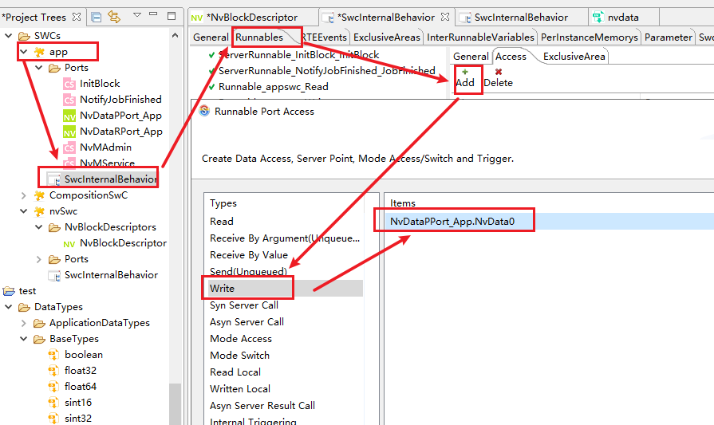
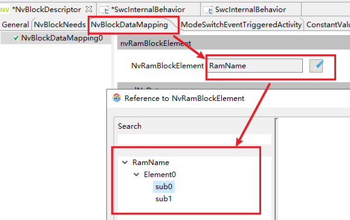
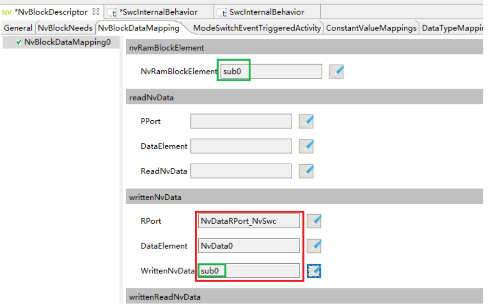

Document State 

- [x] Draft
- [] Released
- [] Modify
- [] Expired


Table: Change History  

| Version | Description | Author                  | Audit                   | Approval                |
| ------- | ----------- | ----------------------- | ----------------------- | ----------------------- |
| 1.0     | 例子        | ning.chen <br> 20230706 | ning.chen <br> 20230706 | ning.chen <br> 20230706 |
| 1.1     | 例子        | --                      | --                      | --                      |


***


# 1. Overview

## 1.1. Purpose

## 1.2. Scope

## 1.3. Reference

Table: Reference

| NO.  | Title | Version |
| ---- | ----- | ------- |
| 1    | xxxx  | 1.0     |
| 2    |       |         |


## 1.4. Terms and abbreviations

| Name | Description      |
| ---- | ---------------- |
| OS   | Operating System |
| BSW  | Basic Software   |


# 2. 原理介绍

>​	
>

## 2.1 SR


### 2.1.1 Category


## 2.2 CS


### 2.2.1 Category


## 2.3 MS


>​	`ModeSwitch`通信（下简称MS通信），指`AUTOSAR`中定义的一种用于进行模式（`Mode`）转换的通信方式。与其他通信方式不同，MS通信需要定义模式。
>
>​	在SWC中，定义模式的方式为定义`ModeDeclarationGroup`，在这个模式组（`ModeDeclarationGroup`）中，来定义具体的模式（`ModeDeclaration`）。对于此处模式组的概念，可以理解为定义了一个状态机，在状态机中定义的状态即为模式。
>
>​	MS通信只允许在ECU内（`Intra-ECU`），在此基础上，又可细分为分区间（`Inter-Partition`）和分区内（`Intra-Partition`），目前**仅支持分区内的MS通信**。
>
>​	MS通信中，发起转换的一方为PPort，其SWC被叫做`ModeManager`，响应转换的一端为RPort，其SWC被叫做`ModeUser`。对于`ModeManager`，可以配置发起模式转换的access(`Rte_Switch`)和获取当前模式的access（`Rte_Mode`）；对于`ModeUser`，可以配置获取当前模式的access（`Rte_Mode`）和响应模式转换的RTEEvent（`SwcModeSwitchEvent`）。
>
>​	MS通信支持1:n（1为`ModeManager`，n为`ModeUser`）的通信方式。
>
>​	可以在MSPort的界面（PPort或者RPort都可以）开启`enhancedAPI`，该选项打开后会影响`Rte_Mode`的生成逻辑

### 2.3.1 ModeDeclarationGroup

如界面所示，有几个需要关注的内容：1、`Category`2、`Initial Mode` 3、`On Transition Value` 4、`Mode Declaration`


#### 2.3.1.1 Category

此处有两种配置，`ALPHABETIC_ORDER`与`EXPLICIT_ORDER`，选择第一种类型，Mode定义（`Mode Declaration`）的value会自增。选择第二种类型，Mode定义的value可以自定义。

#### 2.3.1.2 Initial Mode

选择该模式组初始化的模式

#### 2.3.1.3 On Transition Value

模式机处于转换时，模式机的值

#### 2.3.1.4 Mode Declaration

定义具体的模式名称和其对应的值

### 2.3.2 DisabledMode

>​	`DisabledMode`，是配置在`RTEEvent`上的一个配置项，通过配置该选项，在`DisabledModes`的模式下该`RTEEvent`触发的runnable不会被运行。
>
>​	如上所述，由于该配置需引用mode，因此使用该功能需有MS的RPort。
>
>​	**注意** 在如下类型的`RTEEvent`中，不可设置DisabledMode
>
>​	1、`InitEvent`
>
>​	2、CS通信的相关`RTEEvent`：`OperationInvokedEvent`、`AsynchronousServerCallReturnsEvent`


## 2.4 NV

>AppSwc与NvM通信有两种方式，分别为直接通信和通过NvSwc通信。直接通信中，NvM以ServiceSwc的形式与AppSwc通信，两者间需要通过RTE进行Port的映射，每个`NvBlock`都有单独的CS port，通过port可以以`NvBlock`为单位进行读、写等操作。根据`RAM Block`的存储方式，又分为临时存储和永久存储两种。
>
>对于临时存储，`RAM Block`存于AppSwc中，`RAM Block`没有与NvM中的`NvBlock`映射，于是将哪个`RAM Block`写入到哪个`NvBlock`，或将哪个`NvBlock`读取到哪个`RAM Block`，是用户灵活决定的。
>
>对于永久存储，`RAM Block`存于RTE中，`RAM Block`与`NvBlock`间通过`RteNvRamAllocation`这一配置项进行映射，调用`调用NvM_WritePRAMBlock`(`BlockID`)这一API即可将先前配置的对应的`RAM Block`写入`NvBlock`。
>
>通过NvSwc通信时，`RAM Block`则存于NvSwc的`NvBlockDescriptor`中。NvM不再以ServiceSwc的形式与AppSwc通信，NvM不直接与AppSwc连接，NvM的port也不与NvSwc连接，而是通过`RteNvRamAllocation`这一配置项，将`NvBlockDescriptor`和`NvBlock`映射，相应的NvM的CS通信也都交由NvSwc进行。总之，存储方式不同，读写`RAM Block`的方式和将`RAM Block`写入`NvBlock`的方式也不同。下文介绍三种通信方式的原理。

### 2.4.1 直接通信-临时存储

>这种情况下，`RAM Block`以`NvM_ReadBlock`/`NvM_WriteBlock` API的参数的形式存在，需要用户自己保证`RAM Block`的一致性。详见图1.1。


$$图1.1$$

>以写通信为例，图1.1中Swc1即为AppSwc，Swc1调用Rte_Call_NvM_Service_WriteBlock(&SWC1_RamBlk)，后者将SWC1_RamBlk传递给`NvM_WriteBlock`(BlockID, &SWC1_RamBlk), 注意，`BlockID`是自动生成的参数，与Port绑定。在这种情况下，`RAM Block`的写操作没有任何保护。
>
>若要从`NvBlock`中读取数据并写入`RAM Block`，相似地，Swc1调用`Rte_Call_NvM_Service_ReadBlock`(&SWC1_RamBlk)，后者将SWC1_RamBlk传递给`NvM_ReadBlock`(BlockID, &SWC1_RamBlk)，读取`NvBlock`。

### 2.4.2 直接通信-永久存储

>这种情况下，`RAM Block`的定义是通过在AppSwc的`SwcInternalBehavior`中定义`PerInstanceMemory`完成，有两种定义方式，分别是`C Typed PerInstanceMemory` 和`Autosar Typed` `PerInstanceMemory`，前者的直接使用C语言定义其类型，后者通过 `AutosarDataType`定义其类型。两者均使用`Rte_Pim` API进行调用，详细的调用流程见时序图1.2。


$$图1.2$$

>如图1.2所示，Swc1为AppSwc，调用`Rte_Pim` API，取得`RAM Block`变量，为其赋值。此后Swc1调用`Rte_Call_NvM_Service_WritePRAMBlock`(`BlockID`)，进而调用`调用NvM_WritePRAMBlock`(`BlockID`)，注意，`BlockID`是自动生成的参数，与Port绑定，而`RAM Block`变量并未作为参数传入，而是根据`BlockID`，从`RteNvRamAllocation`中获取对应的`RAM Block`地址。此后`NvM_MainFunction()`中，读取`RAM Block`并写入Ea/Fee。
>
>注意，Swc1也可通过Rte_Call调用`NvM_WriteBlock`，将`RAM Block`和`BlockID`作为参数传入，`NvM_WriteBlock`的优先级高于`调用NvM_WritePRAMBlock`。
>
>从`NvBlock`中读取数据并写入`RAM Block`的过程也可类推，此处不赘述。

### 2.4.3 通过NvSwc通信

>此通信方式有以下特点：
>
>1. 通过`RteNvRamAllocation`这一配置项，映射`NvBlockDescriptor`和`NvBlock`，即每个block对应一个专用的`RAM Block`。
>2. `RAM Block`存于NvSwc中，NvSwc可以与不同SWC传输数据，更灵活地读写`RAM Block`。
>3. 在直接通信的情况下，何时将`RAM Block`写入`NvBlock`完全由AppSwc控制，需要进行许多繁琐的配置，但在实际使用场景中，可能存在不同的写需求，如周期性地写入`NvBlock`（Store Cyclically），或者写了`RAM Block`后立即将`RAM Block`写入`NvBlock`（Store Immediately），而NvSwc则通过dirtyFlag实现不同写策略，简化了配置。
>4. 代替NvM，作为Server为AppSwc提供NvM管理服务。
>
>下文将分四个部分介绍NvSwc的通信原理，分别是显式读写`RAM Block`、隐式读写`RAM Block`、写策略和CS通信。

#### 2.4.3.1 显式读写`RAM Block`

>若AppSwc通过SR port或Nv port与NvSwc的Nv port连接，在NvSwc的`NvBlockDescriptor`的`NvBlockDataMapping`中，可以将NvSwc的Nv port的nvData和`RAM Block`进行映射，从而通过port间的通信读写`RAM Block`。图1.3展示了NvSwc的Nv port的nvData和`RAM Block`是如何进行映射的。


$$图1.3$$  

>nvData可以整体映射到`RAM Block`，也可以映射到`RAM Block`的内部元素，或者nvData的内部元素映射到`RAM Block`的内部元素，如图1.3所示。注意一个`RAM Block`可以通过设置多个`NvBlockDataMapping`，映射到多个nvData。
>下面用时序图介绍显式写的原理。此处没有设置写策略。


$$图1.4$$

>如图1.4所示，调用AppSwc的`RunnableSend()`，其中调用了Rte的显式写API，`Rte_Write(data)`，其中调用了`Rte_MemCpy(ram, data)`，其中的`RAM Block`是根据AppSwc连接的NvSwc的Nv port，再根据`NvBlockDataMapping`中配置的映射规则，找到的nvData对应的`RAM Block`。如此，将值写入`RAM Block`。
>
>一个nvData可能映射到多个`RAM Block`，因此在`Rte_Write(data)`中可能多次调用Rte_MemCpy接口，如Rte_MemCpy(ram1, data)，Rte_MemCpy(ram2, data)，...，将data的值更新至多个`RAM Block`。
>
>由于没有在NvSwc中选择写策略，要调用`NvM_WriteBlock`或`调用NvM_WritePRAMBlock`接口，需要在AppSwc中创建相应的CS Rport，并与NvSwc连接，从而生成Rte_Call，调用`NvM_WriteBlock`或`调用NvM_WritePRAMBlock`接口。
>最后，显式读的过程也可类推，此处不赘述。

#### 2.4.3.2 隐式读写`RAM Block`

>下面用时序图介绍隐式写的原理。此处没有设置写策略。


$$图1.5$$    

>如图1.5所示，在Rte的Task中，先调用Rte_MemCpy(nvData, ram)，根据`NvBlockDataMapping`中配置的映射规则，将`RAM Block`值写入nvData中，再调用AppSwc的`RunnableSend()`，其中调用Rte_IWrite接口，这个接口通过调用Rte_MemCpy(nvData, data)，更新nvData的值为data，最后，调用Rte_MemCpy(ram, nvData)，根据`NvBlockDataMapping`中配置的映射规则，将nvData值写入`RAM Block`中。与显式写相比，在`RunnableSend()`运行过程中，隐式写不会对`RAM Block`做任何操作。
>
>和显式写时一样，一个nvData可能映射到多个`RAM Block`，因此在Rte的Task中，在调用`RunnableSend()`前，会多次调用Rte_MemCpy(nvData, ram)，而`RunnableSend()`结束后，多次调用Rte_MemCpy(ram, nvData)。

#### 2.4.3.3 写策略

>写策略解决的是何时将`RAM Block`写入`NvBlock`的问题，一共有6种写策略，分别是：
>
>1. 周期写（storeCyclic）：将`RAM Block`周期性写入`NvBlock`，需要配置相应的TimingEvent和`NvBlockDescriptor`.`NvBlockNeeds`.cyclicWritingPeriod。
>2. 即时写（storeImmediate）：每当将nvData写入`RAM Block`后，就将`RAM Block`写入`NvBlock`。
>3. 关闭写（storeAtShutdown）：ECU关闭时将`RAM Block`写入`NvBlock`。
>4. 改变写（storeOnChange）：若nvData中和`RAM Block`对应的值，与RamMirror中的值不同，则将`RAM Block`写入`NvBlock`。
>5. 紧急写（storeEmergency）：ECU发生故障时紧急写入。只能由复杂驱动（Complex Driver）实现[TPS_SWCT_01589]。
>6. 模式转换写（storeOnModeSwitch）: NvSwc发生模式转换时，就将`RAM Block`写入`NvBlock`。需要配置`NvBlockDescriptor`.ModeSwitchEventTriggeredActivity，配置相应的ModeSwitchEvent和触发的NvMService(此处即为`NvM_WriteBlock`)。

>写策略的是通过设置RTEEvent和在`NvBlockDescriptor`.`NvBlockNeeds`.`RoleBasedDataAssignment`实现的。表1.1说明了不同写策略的实现方式，其中紧急写由复杂驱动实现，故不做介绍。对于周期写、即时写、关闭写，以时序图的方式介绍其实现过程，分别见图1.6、图1.7、图1.8。

$$表1.1$$

|                              |   周期写    |      即时写       |      关闭写       |      改变写       |   模式转换写    |
| :--------------------------: | :---------: | :---------------: | :---------------: | :---------------: | :-------------: |
|           RTEEvent           | TimingEvent | DataReceivedEvent | DataReceivedEvent | DataReceivedEvent | ModeSwitchEvent |
| RoleBasedDataAssignment.role |      -      |  storeImmediate   |  storeAtShutdown  |   storeOnChange   |        -        |

- 周期写

>下面以图1.6为例，介绍周期写的过程。需要注意的是，显式写与隐式写对周期写并无影响，此处仅作示例。配置好的TimingEvent映射为Os中的Alarm，定期激活Task1，调用Runnable_WriteBlock(`BlockID`, &Ram)，后者调用`NvM_WriteBlock`(`BlockID`, &Ram)，在配置好`RteNvRamAllocation`的前提下，`BlockID`和传入的`RAM Block`地址都由`NvBlockDescriptor`决定。
>
>Task1结束后，Os周期调用`NvM_MainFunction()`，其中调用NvM的Callback函数NvMWriteRamBlockToNv，这个函数由Rte_GetMirror实现，将`RAM Block`的值写入Mirror，再由NvM执行后续操作。


$$图1.6$$    

- 即时写    

>下面以图1.7为例，介绍即时写的过程。以显式写为例，在`Rte_MemCpy(ram, data)`后，通过DataReceivedEvent，激活Runnable，若将DataReceivedEvent映射到了OsTask，则激活Task0，在其中调用Runnable。Runnable中调用`NvM_WriteBlock`接口。
>隐式写也是类似的，在将nvData写回`RAM Block`后，激活Runnable。


$$图1.7$$

- 关闭写    

>下面以图1.8为例，介绍关闭写的过程。关闭写与即时写都是在将数据写回`RAM Block`后，再通过DataReceivedEvent激活Runnable，若将DataReceivedEvent映射到了OsTask，则激活Task0，在其中调用Runnable。与即时写不同的是，Runnable中调用NvM_SetRamBlockStatus接口，将将`RAM Block`的状态转换为Valid/Changed，如此，后续BswM收到关闭ECU的请求后，可以调用`NvM_WriteAll`接口，将`RAM Block`写入Nv Block。


$$图1.8$$

- 模式转换写、改变写

>模式转换写不再与写入`RAM Block`的操作有关联，而是当NvSwc模式转换时，通过ModeSwitchEvent，激活Runnable，若将ModeSwitchEvent映射到了OsTask，则激活Task0，在其中调用Runnable。Runnable中调用`NvM_WriteBlock`接口。
>改变写暂时未实现。

### 2.4.4 CS通信

>NvSwc代替NvM，作为Server为AppSwc提供NvM管理服务，NvM请求的服务，也在NvSwc得到部分实现。

#### 2.4.4.1 NvSwc作为Server

> 如前文所写，通过`RteNvRamAllocation`可以将`BlockID`和`NvBlockDescriptor`绑定，相应的，这个`BlockID`对应的`NvBlock`所能提供的服务也与`NvBlockDescriptor`绑定，若AppSwc请求这个`NvBlock`的服务，只需要将自己的CS RPort与NvSwc的CS PPort连接，在相应的`NvBlockDescriptor`中，通过`RoleBasedPortAssignment`，将NvSwc的CS PPort与role绑定即可。
>
> 如图1.4所示，在AppSwc通过Runnable调用Rte_Call时，会被宏替换为相应的NvM提供的API，由NvM进行后续操作。

#### 2.4.4.2 NvSwc作为Client

> 和上一节一样，当NvM请求AppSwc的服务，通过`RteNvRamAllocation`，找到对应的`NvBlockDescriptor`，再通过其中的`RoleBasedPortAssignment`，找到和role对应的CS RPort，得到连接的AppSwc，读取OperationInvokedEvent，从而激活Runnable。

## 2.5 Parament


### 2.5.1 Category


## 2.6 Trigger


### 2.6.1 Category


## 2.7 IRV


### 2.7.1 Category


# 3. SR Functional Requirements

#### 

# 4. CS Functional Requirements

#### 

# 5. MS Functional Requirements

## 5.1 分区内

### 5.1.1 SWC间

#### 5.1.1.1 定义ModeDeclarationGroup

| 定义`ModeDeclarationGroup`                                   |
| ------------------------------------------------------------ |
| **[ReqID]**                                                  |
| **[Short Description]**  在`Rte_<cts>_Type.h`中生成模式的定义 |
| **[是否可选]** <font color=red>否</font>                     |
| **[state]** <font color=green>已实现</font>                  |
| **[配置方式]** 在`DataTypes`下的`ModeDeclarationGroups`文件夹，右键新建一个`ModeDeclarationGroup`: <br> 具体配置可见[2.3.1](#2.3.1 ModeDeclarationGroup) |
| [生成代码](#10.1.1 Rte_Swc_Type_h_1)                         |

#### 5.1.1.2 定义ModeSwitchInterface

| 定义`ModeSwitchInterface`                                    |
| ------------------------------------------------------------ |
| **[ReqID]**                                                  |
| **[Short Description]**  定义用于MS通信的PortInterface       |
| **[是否可选]** <font color=red>否</font>                     |
| **[state]** <font color=green>已实现</font>                  |
| **[配置方式]** 在`PortInterface`文件夹，右键新建一个`ModeSwitchInterface`: <br> 在Type选项中引用上一节创建的`ModeDeclarationGroup`。 |
| [生成代码] 无                                                |

#### 5.1.1.3 配置原子SWC

| 配置SWC                                                      |
| ------------------------------------------------------------ |
| **[ReqID]**                                                  |
| **[Short Description]**  配置用于MS通信的SWC                 |
| **[是否可选]** <font color=red>否</font>                     |
| **[state]** 已实现                                           |
| **[配置方式]**1、配置ModeManager<br>在`SWCs`文件夹，右键创建一个应用SWC：，在`Ports`文件夹下右键新建一个`ModeSwitchPPort`： <br>将此处的`PortInterface`引用上一节创建的Interface。双击该SWC下的`SwcInternalBehavior`，创建`Runnable`和`RTEEvent`。在`Runnable`中创建access：<br>对于ModeManager来说，可以配置获取当前模式的`ModeAccess`和转换模式的`ModeSwitch`。<br>2、配置ModeUser<br>和第一步类似，创建一个SWC，新建一个`ModeSwitchRPort`，引用Interface。双击该SWC下的`SwcInternalBehavior`，创建`Runnable`和`RTEEvent`。在`Runnable`中创建access，对于ModeUser来说，只可以配置获取当前模式的`ModeAccess`。在RTEEvent界面新增`SwcModeSwitchEvent`：<br>对于此类型的RTEEvent，可配置触发的时机（`Activation`)，分别为进入模式时（`OnEntry`)，退出模式时（`OnExit`)，模式转换时（`OnTransition`) |
| [生成代码1](#10.2.1 Rte_C_1)、[生成代码2](#10.2.2 Rte_C_2)、[生成代码3](#10.3.1 Rte_Swc_H_1) |
| **[备注]** 在Port的配置界面中，有一个EnhancedModeApi的选项，开启该选项后，`Rte_Mode`的生成逻辑会有差别。 |

#### 5.1.1.4 在组合SWC中连线

| 在组合SWC中连线                                              |
| ------------------------------------------------------------ |
| **[ReqID]**                                                  |
| **[Short Description]**  将ModeManager和ModeUser连接起来     |
| **[是否可选]** <font color=red>否</font>                     |
| **[state]** 已实现                                           |
| **[配置方式]** 在`SWCs`文件夹下新建一个组合SWC，在其中将上一节创建的两个原子SWC进行连线。 |
| [生成代码] 无                                                |

### 5.1.2 和BSW通信

## 5.2 分区间

## 5.3 DisabledMode

### 5.3.1 配置MSPort

此部分可参考[5.1.1](#5.1.1 SWC间)来配置MS的RPort

### 5.3.2 配置DisabledMode

| 配置`disabledMode`                                           |
| ------------------------------------------------------------ |
| **[ReqID]**                                                  |
| **[Short Description]**  配置`DisabledMode`的引用            |
| **[是否可选]** <font color=red>是</font>                     |
| **[state]** <font color=green>已实现</font>                  |
| **[配置方式]** 在`RTEEvent`界面选择需要引用的模式：<br> |
| [生成代码1](#10.2.1 Rte_C_1)、[生成代码2](#10.3.1 Rte_Swc_H_1) |
| **[备注]** 在此界面会发现，这里是可以选择多个`DisabledMode`的，这也意味着同一个`RTEEvent`可以在多个mode下无效 |


# 6. NV Functional Requirements

能否descriptor的数量和nvm的block的数量不同
能否

>本节根据AppSwc与NvM的通信方式，划分为两个部分，分别是直接通信和通过NvSwc通信。
>
>两种通信方式都需要先在Configurator中进行NvM的配置，包括配置NvMCommon和新建NvMBlock如下所示。配置完成后导出的Arxml，导入SWCDesigner。
>
>
>

## 6.1 AppSwc与NvM直接通信（略）

### 6.1.1 临时存储

### 6.1.2 永久存储

#### 6.1.2.1 定义ram类型

| 定义Ram类型                                                  |
| ------------------------------------------------------------ |
| **[ReqID]**                                                  |
| **[Short Description]**  在Rte.c中生成Ram类型的定义          |
| **[是否可选]** <font color=red>否</font>                     |
| **[state]** <font color=red>未实现</font>                    |
| **[配置方式]** 新建`ApplicationSwc`后，在`InternalBehavior`中，选中`PerInstanceMemorys`选项卡，定义Ram的类型，有两种方法：<br/>1.直接用C语言进行定义（`C Typed`），右键点击，选择` Add PerInstanceMemery by C`，在type define中输入类型的定义，在type中输入类型的名字。<br/>2.使用AUTOSAR模型定义（`Autosar Typed`），右键点击，选择`Add PerInstanceMemery by AUTOSAR`，点击Type，选择实现数据类型。  |
| **[生成代码]**   [在Rte_types.h中生成类型的定义](#10.6.1 Rte_Types_H_1)<br/>[在Rte_swc.h中生成类型的定义](#10.3.5 Rte_Swc_H_5)<br/> |


#### 6.1.2.2 声明永久ram变量

| 声明永久ram变量                                              |
| ------------------------------------------------------------ |
| **[ReqID]**                                                  |
| **[Short Description]** 在Rte.c中声明ram变量                 |
| **[是否可选]** <font color=red>否</font>                     |
| **[state]** <font color=red>未实现</font>                    |
| **[配置方式]** 在`ApplicationSwc`的`InternalBehavior`中，选择`SwcServicedependencys`选项卡</br>1.新建SwcServicedependency;</br>2.Scenario选择Permanent Ram Block;</br>3.新增RoleBasedDataAssignment，role配置为ramBlock，UsedPimDataElement选择[6.1.2.1 定义ram类型](#6.1.2.1 定义ram类型)中定义的Pim变量   </br>  |
| **[生成代码]**  [10.2.15 Rte_C_15](#10.2.15 Rte_C_15)        |

<a id='定义ram初始值'></a>

#### 6.1.2.3 定义ram初始值

| 定义ram初始值                                                |
| ------------------------------------------------------------ |
| **[ReqID] **                                                 |
| **[Short Description]** 在Rte.c中声明ram初始值常量           |
| **[是否可选]**  <font color=green>是</font>                  |
| **[state]**                                                  |
| **[配置方式]** 在`ApplicationSwc`的`InternalBehavior`中，选中`PerInstanceMemorys`选项卡，选择要配置初始值的Pim，分两种情况：</br>1.直接用C语言进行定义（`C Typed`）的Pim，在`Init Value`中输入初始值。<br/>2.使用AUTOSAR模型定义（`Autosar Typed`），点击`Init Value`，设置初始值。  |
| **[生成代码]**                                               |
| <a id='初始化永久ram'></a>                                   |

#### 6.1.2.4 初始化永久ram

| 初始化永久ram                                                |
| ------------------------------------------------------------ |
| **[ReqID] **                                                 |
| **[Short Description]**                                      |
| **[是否可选]**  <font color=green>是</font>                  |
| **[state]** <font color=red>未实现</font>                    |
| **[配置方式]** 完成[6.1.2.1 定义ram类型](#6.1.2.1 定义ram类型)、[6.1.2.2 声明永久ram变量](#6.1.2.2 声明永久ram变量)、[6.1.2.3 定义ram初始值](#6.1.2.3 定义ram初始值)即可 |
| **[生成代码]** [10.2.3.2 Rte_C_3_2](#10.2.3.2 Rte_C_3_2)     |

## 6.2 AppSwc通过NvSwc通信

>根据功能的不同，将AppSwc与NvSwc的通信分为两类，一是读写存储于NvSwc中的`RAM Block`，二是通过CS通信管理Nv Data。此外，NvSwc提供了不同的写策略，包括即时写（Store Immediately），周期写（Store Cyclically），关闭写(Store At Shutdown)等。本节将分三个部分介绍以上内容。

### 6.2.1 读写`RAM Block`

>读写`RAM Block`，有两种配置方式，一是连接AppSwc的SR port与NvSwc的Nv port进行通信，二是连接AppSwc的Nv port与NvSwc的Nv port进行通信。两种方式生成的代码是一样的，下文从生成代码的角度介绍读写`RAM Block`的实现。

<a id='6.2.1.1'></a>

#### 6.2.1.1 定义Ram变量

| 定义Ram变量                                                  |
| ------------------------------------------------------------ |
| **[ReqID]**                                                  |
| **[Short Description]**  在Rte.c中生成Ram变量的定义          |
| **[是否可选]** <font color=red>否</font>                     |
| **[state]** <font color=green>已实现</font>                  |
| **[配置方式]** 新建NvSwc后，新建`NvBlockDescriptor`，打开General选项卡，设置RamBlock的名称和类型<br> |
| [生成代码](#Rte_C_3_1)                                       |

#### 6.2.1.2 定义Ram变量初始值 

| 定义Ram变量初始值                                            |
| ------------------------------------------------------------ |
| **[ReqID]**                                                  |
| **[Short Description]**  在Rte.c中生成Ram变量的初始值        |
| **[是否可选]** <font color=green>是</font>                   |
| **[state]** <font color=green>已实现</font>                  |
| **[配置方式]** 新建NvSwc后，新建`NvBlockDescriptor`，打开General选项卡，设置RamBlock的名称和类型<br> |
| [生成代码](#Rte_C_3_2)                                       |

#### 6.2.1.3 初始化Ram变量

| 初始化Ram变量                                                |
| ------------------------------------------------------------ |
| **[ReqID]**                                                  |
| **[Short Description]**  在Rte.c中将Ram变量的初始值赋给Ram变量 |
| **[是否可选]** <font color=green>是</font>                   |
| **[state]** <font color=green>已实现</font>                  |
| **[配置方式]** 完成6.2.1.1和6.2.1.2即可                      |
| [生成代码](#Rte_C_3_3)                                       |

<a id='定义Rom常量'></a>

#### 6.2.1.4  定义Rom常量

| 定义Rom常量                                                  |
| ------------------------------------------------------------ |
| **[ReqID]**                                                  |
| **[Short Description]**  在Rte.c中生成Rom常量                |
| **[是否可选]** <font color=green>是</font>，若配置了Rom，则使用NvMNotifyInitBlock时会将ROM复制到`RAM Block`中 |
| **[state]** <font color=green>已实现</font>                  |
| **[配置方式]** 新建NvSwc后，新建`NvBlockDescriptor`，打开General选项卡，设置RomBlock的名称和类型<br> |
| [生成代码](#Rte_C_3_4)                                       |

<a id='6.2.1.5'></a>

#### 6.2.1.5  显式通信-写

| 显式通信-写                                                  |
| ------------------------------------------------------------ |
| **[ReqID]**                                                  |
| **[API定义]**  [Rte_Write](#Rte_Write)                       |
| **[state]** <font color=green>已实现</font>                  |
| **[配置方式]** <br>1.新建NvDataInterface和nvData<br><br>2.在AppSwc中新建NvDataPPort<br><br>3.相似地，在NvSwc中新建NvDataRPort，并在组合Swc中连接两个Port<br><br>4.在AppSwc中配置Runnable，并添加access，选择Rte_Write<br><br>5.[定义Ram变量](#6.2.1.1)<br>6.在NvSwc的`NvBlockDescriptor`的`NvBlock`Mapping选项卡中，配置`RAM Block`和nvData的映射关系，nvSwc中为NvDataRPort，故此处配置writtenNvData。注意，writtenNvData的值和NvRamBlockElement的值的类型应当兼容<br><br>7.导出Arxml，并导入Configurator<br>8.在Configurator中生成代码。 |
| [生成代码](#Rte_C_3_5)                                       |

<a id='6.2.1.6'></a>

#### 6.2.1.6  显式通信-读

| 显式通信-读                                                  |      |
| ------------------------------------------------------------ | ---- |
| **[ReqID]**                                                  |      |
| **[API定义]**  [Rte_Read](#Rte_Read) [Rte_DRead](#Rte_DRead) |      |
| **[state]** <font color=green>已实现</font>                  |      |
| **[配置方式]** <br>1.新建NvDataInterface和nvData<br><br>2.在AppSwc中新建NvDataRPort<br><br>3.相似地，在NvSwc中新建NvDataPPort，并在组合Swc中连接两个Port<br><br>4.在AppSwc中配置Runnable，并添加access，选择Rte_Read或Rte_DRead<br><br>5.[定义Ram变量](#6.2.1.1)<br>6.在NvSwc的`NvBlockDescriptor`的`NvBlock`Mapping选项卡中，配置`RAM Block`和nvData的映射关系，nvSwc中为NvDataPPort，故此处配置readNvData。注意，readNvData的值和NvRamBlockElement的值的类型应当兼容<br><br>7.导出Arxml，并导入Configurator<br>8.在Configurator中生成代码。 |      |
| [生成代码](#Rte_C_6)                                         |      |

#### 6.2.1.7  隐式通信-写

|隐式通信-写|
|----|--|
|**[ReqID]** ||
|**[API定义]**  [Rte_IWrite](#Rte_IWrite)|
|**[state]** <font color=green>已实现</font>|
|**[配置方式]** <br>1.完成[显式通信-写](#6.2.1.5)中的前三个步骤<br>2.在AppSwc中配置Runnable，并添加access，选择Rte_IWrite<br><br>3.[定义Ram变量](#6.2.1.1)<br>4.在NvSwc的`NvBlockDescriptor`的`NvBlock`Mapping选项卡中，配置`RAM Block`和nvData的映射关系，nvSwc中为NvDataRPort，故此处配置writtenNvData。注意，writtenNvData的值和NvRamBlockElement的值的类型应当兼容<br><br>7.导出Arxml，并导入Configurator<br>8.在Configurator中生成代码。|
|**[生成代码]** [定义nvData<br>](#Rte_C_7)[Runnable前的Rte_MemCpy语句<br>](#Rte_C_8)[Runnable<br>](#Swc_C_1_1)[Rte_IWrite宏替换<br>](#Rte_Swc_H_2)[Rte_IWrite的实现<br>](#Rte_C_10)|

#### 6.2.1.8  隐式通信-读

| 隐式通信-读                                                  |      |      |
| ------------------------------------------------------------ | ---- | ---- |
| **[ReqID]**                                                  |      |      |
| **[Short Description]**  在Rte.c中生成Rom常量                |      |      |
| **[state]** <font color=green>已实现</font>                  |      |      |
| **[配置方式]** <br>1.完成[显式通信-读](#6.2.1.6)中的前三个步骤<br>2.在AppSwc中配置Runnable，并添加access，选择Rte_IRead<br><br>3.[定义Ram变量](#6.2.1.1)<br>4.在NvSwc的`NvBlockDescriptor`的`NvBlock`Mapping选项卡中，配置`RAM Block`和nvData的映射关系，nvSwc中为NvDataPPort，故此处配置readNvData。注意，readNvData的值和NvRamBlockElement的值的类型应当兼容<br><br>7.导出Arxml，并导入Configurator<br>8.在Configurator中生成代码。 |      |      |
| **[生成代码]** [定义nvData<br>](#Rte_C_7)[Runnable前的Rte_MemCpy语句<br>](#Rte_C_8)[Runnable<br>](#Swc_C_1_2)[Rte_IRead宏替换<br>](#Rte_Swc_H_3) |      |      |

### 6.2.2  写策略

#### 6.2.2.1 周期写

|周期写|
|----|-|
|**[ReqID]**| 
|**[Short Description]**  周期将Ram变量复制到MirrorBuffer或硬件中|
|**[state]** <font color=green>已实现</font>|
|**[配置方式]** <br>1.在nvSwc的`SwcInternalBehavior`中，打开Runnable选项卡，新建一个Runnable。<br>2.在nvSwc的`SwcInternalBehavior`中，打开RTEEvents选项卡，新建TimingEvent，设置周期调用的实现，并选择刚刚新建的Runnable。<br>3.点开nvSwc的nvDescriptor，打开General选项卡，点击Timing Event按钮，选择刚刚新建的TimingEvent。<br> <br>4.在NvSwc的`NvBlockDescriptor`中，选择`NvBlockNeeds`选项卡，勾选Store Cyclic选项<br>5.SWCDesigner导出Arxml文件，并导入Configurator，在Rte中配置`RteNvRamAllocation`，将nvSwc的`NvBlockDescriptor`和NvM中配置的Block映射起来。<br>6.在Rte中，将TimingEvent映射到Os Task Alarm。详见[TimingEvent的配置](#TimingEvent)。<br>7. 生成代码。|
|**[生成代码]** [激活TimingEvent的Alarm<br>](#Rte_C_100)[对应的Task<br>](#Rte_C_102)[Runnable<br>](#Swc_C_2)|


#### 6.2.2.2 关闭写

| 关闭写                                                       |      |
| ------------------------------------------------------------ | ---- |
| **[ReqID]**                                                  |      |
| **[Short Description]**  将数据写入Ram后，调用NvM_SetRamBlockStatus，将RamBlock的状态转换为Valid/Changed，从而使得ECU关闭时，能够调用NvM_WriteAll。 |      |
| **[state]** <font color=green>已实现</font>                  |      |
| **[配置方式]** <br>1.在nvSwc的`SwcInternalBehavior`中，打开Runnable选项卡，新建一个Runnable。<br>2.在nvSwc的`SwcInternalBehavior`中，打开RTEEvents选项卡，新建DataReceivedEvent，并选择刚刚新建的Runnable。<br>3.在NvSwc的`NvBlockDescriptor`中，选择`NvBlockNeeds`选项卡，勾选Store At Shutdown选项。<br> 4.在NvSwc的`NvBlockDescriptor`中，选择`NvBlockNeeds`选项卡，在`RoleBasedDataAssignment`表格中，点击add，点击Role列的下拉框，选择StoreAtShutdown，在usedDataElement中选择对应的Port的NvData。<br><br> 5.SWCDesigner导出Arxml文件，并导入Configurator，在Rte中配置`RteNvRamAllocation`，将nvSwc的`NvBlockDescriptor`和NvM中配置的Block映射起来。<br>6.在Rte中，将DataReceivedEvent映射到Os Task。详见[DataReceivedEvent的配置](#DataReceivedEvent)。<br>7. 生成代码。 |      |
| **[生成代码]** [在显式写或隐式写Ram操作完成后，激活Task<br>](#Rte_C_101)[对应的Task<br>](#Rte_C_102)[Runnable<br>](#Swc_C_3) |      |


#### 6.2.2.3 即时写

|即时写|
|----|--|
|**[ReqID]**| 
|**[Short Description]**  在将数据写入`RAM Block`后，立即将Ram变量复制到MirrorBuffer或硬件中|
|**[state]** <font color=green>已实现</font>|
|**[配置方式]** <br>1.在nvSwc的`SwcInternalBehavior`中，打开Runnable选项卡，新建一个Runnable。<br>2.在nvSwc的`SwcInternalBehavior`中，打开RTEEvents选项卡，新建DataReceivedEvent，并选择刚刚新建的Runnable。<br>3.在NvSwc的`NvBlockDescriptor`中，选择`NvBlockNeeds`选项卡，勾选Store Immediate选项。<br>4.在NvSwc的`NvBlockDescriptor`中，选择`NvBlockNeeds`选项卡，在`RoleBasedDataAssignment`表格中，点击add，点击Role列的下拉框，选择StoreImmediate，在usedDataElement中选择对应的Port的NvData。<br> 5.SWCDesigner导出Arxml文件，并导入Configurator，在Rte中配置`RteNvRamAllocation`，将nvSwc的`NvBlockDescriptor`和NvM中配置的Block映射起来。<br>5.在Rte中，将DataReceivedEvent映射到Os Task。详见[DataReceivedEvent的配置]。<br>6. 生成代码。|
|**[生成代码]** [在显式写或隐式写Ram操作完成后，激活Task<br>](#Rte_C_101)[对应的Task<br>](#Rte_C_102)[Runnable<br>](#Swc_C_2)|


#### 6.2.2.4 更改写

| 更改写                                    |
| ----------------------------------------- |
| **[ReqID]**                               |
| **[Short Description]**                   |
| **[state]** <font color=red>未实现</font> |
| **[配置方式]**                            |
| **[生成代码]**                            |


#### 6.2.2.5 模式转换写

|模式转换写|
|----|-|
|**[ReqID]**| 
|**[Short Description]**  |
|**[state]** <font color=red>未实现</font>|
|**[配置方式]** <br>1.在nvSwc的`SwcInternalBehavior`中，打开Runnable选项卡，新建一个Runnable。<br>2.在nvSwc的`SwcInternalBehavior`中，打开RTEEvents选项卡，新建SwcModeSwitchEvent，并选择刚刚新建的Runnable。<br>3.在NvSwc的`NvBlockDescriptor`中，点击ModeSwitchEventTriggeredActivity选项卡，添加activity，并选择刚才新建的SwcModeSwitchEvent。<br><br>4.SWCDesigner导出Arxml文件，并导入Configurator，在Rte中配置`RteNvRamAllocation`，将nvSwc的`NvBlockDescriptor`和NvM中配置的Block映射起来。<br>5.在Rte中，将SwcModeSwitchEvent映射到Os Task。详见[SwcModeSwitchEvent的配置]。<br>6. 生成代码。|
|**[生成代码]** [nvSwc发生模式转换时，激活Task<br>](#Rte_C_101)[对应的Task<br>](#Rte_C_102)[Runnable<br>](#Swc_C_2)|


### 6.2.3 CS通信

>AppSwc和NvSwc之间的CS通信，根据方向分为NvSwc作为Client请求AppSwc的服务和AppSwc作为Client请求NvSwc的服务两种。
>对于以下所有CS通信的API，需要作以下配置：
>
>1. 在AppSwc上新建NvM_Admin和NvM_Service的RPort，NvMNotifyInitBlock、NvM_Mirror、NvMNotifyJobFinished的PPort。
>2. 在NvSwc上新建NvM_Admin和NvM_Service的PPort，NvMNotifyInitBlock、NvM_Mirror、NvMNotifyJobFinished的RPort。
>3. 在组合Swc中连接AppSwc和NvSwc的对应Port。

#### 6.2.3.1 NvM Callback

- 初始化Ram

| 初始化Ram                                                    |      |
| ------------------------------------------------------------ | ---- |
| **[ReqID]**                                                  |      |
| **[API]** Rte_NvMNotifyInitBlock_\<nvSwcName>_\<descriptorName> |      |
| **[Short Description]** 使用Rom InitValue和AppSwc的ServerRunnable初始化`RAM Block` |      |
| **[Description]** 1.若在`NvBlockDescriptor`中配置了romBlock InitValue，优先使用InitValue初始化RAM；<br>2.若使用Rom的InitValue初始化了RAM，或调用AppSwc的服务初始化了RAM，则返回E_OK，否则返回RTE_E_RAM_UNCHANGED |      |
| **[state]** <font color=green>已实现</font>                  |      |
| **[配置方式]** <br>1.配置AppSwc的服务(可选)：<br>1.1 使用SWCDesigner在AppSwc中新建ServerRunnable<br>1.2.使用SWCDesigner在AppSwc中新建OperationInvokedEvent，并选择刚才新建的Runnable<br>1.3. 使用Configurator将OperationInvokedEvent映射到OS<br>2.[定义Rom常量](#定义Rom常量)(可选)<br> 3. 使用`RteNvRamAllocation`将`NvBlockDescriptor`映射到NvMBlock |      |
| **[生成代码]** [Rte_NvMNotifyInitBlock实现<br>](#Rte_C_11)[Rte_NvMNotifyInitBlock宏替换<br>](#Rte_NvM_H_1)[extern Rte_NvMNotifyInitBlock函数](#Rte_NvM_H_2) |      |

- 任务完成通知

|任务完成通知|
|----|-|
|**[ReqID]** |
|**[API]** Rte_NvMNotifyJobFinished_\<nvSwcName>_\<descriptorName>|
|**[Short Description]** 当任务完成时接收来自NvM的通知并将其转发到SW-C。|
|**[state]** <font color=green>已实现</font>|
|**[配置方式]** <br>1.配置AppSwc的服务：<br>2.使用SWCDesigner在AppSwc中新建ServerRunnable<br>3.使用SWCDesigner在AppSwc中新建OperationInvokedEvent，并选择刚才新建的Runnable<br>4.使用Configurator将OperationInvokedEvent映射到OS<br>5.使用`RteNvRamAllocation`将`NvBlockDescriptor`映射到NvMBlock|
|**[生成代码]** [Rte_NvMNotifyJobFinished实现<br>](#Rte_C_12)[Rte_NvMNotifyJobFinished宏替换<br>](#Rte_NvM_H_3)[extern Rte_NvMNotifyJobFinished函数](#Rte_NvM_H_4)|


- 将Ram写入Mirror

|将Ram写入Mirror|
|----|-|
|**[ReqID]** |
|**[API]** [Rte_GetMirror](#Rte_GetMirror)|
|**[Short Description]**  |
|**[state]** <font color=green>已实现</font>|
|**[配置方式]**  <br>1.在Configurator中，进入NvMVlockDescriptor，进入相应的Block，勾选NvMBlockUseSynMechanism<br>2.使用`RteNvRamAllocation`将`NvBlockDescriptor`映射到NvMBlock|
|**[生成代码]** [Rte_GetMirror实现<br>](#Rte_C_13)[Rte_GetMirror宏替换<br>](#Rte_NvM_H_5)[extern Rte_GetMirror函数](#Rte_NvM_H_6)|

- 将Mirror写入Ram

|将Mirror写入Ram|
|----|-|
|**[ReqID]**| 
|**[API]** [Rte_SetMirror](#Rte_SetMirror)|
|**[Short Description]**  |
|**[state]** <font color=green>已实现</font>|
|**[配置方式]**  <br>1.在Configurator中，进入NvMVlockDescriptor，进入相应的Block，勾选NvMBlockUseSynMechanism<br>2.使用`RteNvRamAllocation`将`NvBlockDescriptor`映射到NvMBlock|
|**[生成代码]** [Rte_SetMirror实现<br>](#Rte_C_14)[Rte_SetMirror宏替换<br>](#Rte_NvM_H_7)[extern Rte_SetMirror函数](#Rte_NvM_H_8)|


#### 6.2.3.2 AppSwc请求NvSwc提供服务

|AppSwc请求NvSwc提供服务|
|----|-|
|**[ReqID]**| 
|**[API]** -|
|**[Short Description]**  分为NvM_Service和NvM_Admin，调用方式一致|
|**[state]** <font color=green>已实现</font>|
|**[配置方式]** <br>1. 配置NvSwc的服务：<br>1.1 使用SWCDesigner在NvSwc中新建ServerRunnable<br>1.2 使用SWCDesigner在NvSwc中新建OperationInvokedEvent，并选择刚才新建的Runnable<br>2. 配置AppSwc：<br>2.1 使用SWCDesigner在AppSwc中新建Runnable<br>2.2 在新建的Runnable中添加access，选择需要调用的NvM Api<br>3. 使用Configurator将OperationInvokedEvent映射到OS<br>4. 使用`RteNvRamAllocation`将`NvBlockDescriptor`映射到NvMBlock|
|**[生成代码]** [AppSwc的Runnable<br>](#Swc_C_4)[Rte_Call宏替换<br>](#Rte_Swc_H_4)|

以下属性是可选的。  
[ASIL] A/B/C/D/QM  
[ReqSource] Internal/Customer/FMEA/Spec  
[ReqPriority] High/Mid/Low  
[Verification] 测试方法  
[ReleasePlan]  
[Remarks]

# 7. Para Functional Requirements

## 7.1 Rte_Prm

> 本节介绍的API提供对通过ParameterInterface创建的标定参数的访问。
>
> 根据Rte为应用提供的访问方式，分为4个部分：1.直接读取访问；2.单指针法；3.双指针法；4.Init_Ram法。
>
> 对于上述的每个部分，需要作以下配置：
>
> 1. 在SwcDesigner中创建ParameterInterface，并在ParameterInterface中创建标定参数，然后配置标定参数的属性
> 2. 在Configurator中配置Rte
>
> 接下来做详细介绍


### 7.1.1 直接读取访问

由于各个关键配置项会影响不同的粒度（不同范围的标定参数），因此列出一个表格说明，可参照配置。
其中，第一个配置项SwCalibrationAccess是标定参数的属性。

<a id='Table3.1'></a>
**表3.1**

| SwCalibrationAccess                           | RteCalibrationSupport       | RteCalibrationSupportEnabled | RteCalibrationSwAddrMethodRef       | layer                                         | Result                        |
| --------------------------------------------- | --------------------------- | ---------------------------- | ----------------------------------- | --------------------------------------------- | ----------------------------- |
| <font color=red>notAccessible/readOnly</font> | any value                   | any value                    | any value                           | 对应的标定参数                                | 生成代码[Direct_1](#Direct_1) |
| any value                                     | <font color=red>NONE</font> | any value                    | any value                           | 全局所有的标定参数                            | 生成代码[Direct_1](#Direct_1) |
| any value                                     | any value                   | <font color=red>false</font> | any value                           | 当前Swc中的所有标定参数                       | 生成代码[Direct_1](#Direct_1) |
| any value                                     | any value                   | any value                    | <font color=red>no reference</font> | 当前Swc中绑定了对应SwAddrMethod的所有标定参数 | 生成代码[Direct_1](#Direct_1) |

|

如[表3.1](#Table3.1)，any value表示任意取值。除了SwCalibrationAccess是SwcDesigner中配置，其他配置项均在Configurator中配置。接下来按照表3.1中的四行详细说明配置的步骤。

#### 7.1.1.1 SwCalibrationAccess

由[表3.1](#Table3.1)的第一行，将SwcDesigner的ParameterInterface中的对应标定参数的SwCalibrationAccess设置为notAccessible或者readOnly，其他配置项可以设置为任意值。

则为对应的这个标定参数提供直接读取访问，生成代码[Direct_1](#Direct_1)。

|                                                              |
| ------------------------------------------------------------ |
| **[ReqID]**                                                  |
| **[Short Description]**  Rte为应用提供对标定参数的直接读取访问（调用API直接访问标定参数） |
| **[state]** <font color=green>已实现</font>                  |
| **[配置方式]** <br><br>**在SwcDesigner中：**<br><br>1.首先，创建ParameterInterface，在ParameterInterface中创建标定参数。<br><br>2.然后，为标定参数设置属性。<br>如图，Init_Value可根据需要进行配置；Type根据需求选择不同的数据类型；Sw Implementation Policy<font color=red>不需要修改</font>，设置为默认值standard即可。<br>Sw Calibration Access可以设置为**notAccessible或者readOnly**。<br>对于Sw Addr Method，需要创建对应的SwAddrMethod并绑定。<br>**创建SwAddrMethod时不需要设置，按照默认即可。**<br><br>3.接下来，在ParameterSwC和AtomicSwC中分别创建PPort和RPort，并将它们引用同一个ParameterInterface。<br><br>4.接下来，在CompositionSwC中将上面建立的两个port连接起来。<br><br>**在Configurator中：**<br><br>由[表3.1](#Table3.1)，可将下面的各项配置设置为任意值，也可以选择不配置，保持默认值。<br><br>**（1）RteCalibrationSupport**<br>将RteCalibrationSupport设置为任意值（也可不进行设置，保持默认，不会影响生成）。<br>**（2）RteCalibrationSupportEnabled**<br>将RteCalibrationSupportEnabled设置为任意值（也可不进行设置，保持默认，不会影响生成）。<br>**（3）RteCalibrationSwAddrMethodRef**<br>将RteCalibrationSwAddrMethodRef设置为任意值（也可不进行设置，保持默认，不会影响生成）。 |
| **<a id='Direct_1'></a>[生成代码]** <br> [Swc_C_5](#Swc_C_5)、[Rte_Swc_H_12](#Rte_Swc_H_12)、[Rte_C_23](#Rte_C_23)、[Rte_Type_H_9](#Rte_Type_H_9) |

|

#### 7.1.1.2 RteCalibrationSupport

由[表3.1](#Table3.1)的第二行，将Configurator中的RteCalibrationSupport设置为NONE，其他各项配置可以设置为任意值。

则为全局所有的标定参数提供直接读取访问，生成代码[Direct_1](#Direct_1)。

|                                                              |
| ------------------------------------------------------------ |
| **[ReqID]**                                                  |
| **[Short Description]**  Rte为应用提供对标定参数的直接读取访问（调用API直接访问标定参数） |
| **[state]** <font color=green>已实现</font>                  |
| **[配置方式]** <br><br>**在SwcDesigner中：**<br><br>1.首先，创建ParameterInterface，在ParameterInterface中创建标定参数。<br><br>2.然后，为标定参数设置属性。<br>如图，Init_Value可根据需要进行配置；Type根据需求选择不同的数据类型；Sw Implementation Policy和Sw Calibration Access<font color=red>不需要修改</font>，设置为默认值standard即可。<br><br>对于Sw Addr Method，需要创建对应的SwAddrMethod并绑定。<br><br>3.接下来，在ParameterSwC和AtomicSwC中分别创建PPort和RPort，并将它们引用同一个ParameterInterface。<br><br>4.接下来，在CompositionSwC中将上面建立的两个port连接起来。<br><br>**在Configurator中：**<br><br>**（1）RteCalibrationSupport**<br>将RteCalibrationSupport设置为NONE。<br>**（2）RteCalibrationSupportEnabled**<br>将RteCalibrationSupportEnabled设置为任意值（也可不进行设置，保持默认，不会影响生成）。<br>**（3）RteCalibrationSwAddrMethodRef**<br>将RteCalibrationSwAddrMethodRef设置为任意值（也可不进行设置，保持默认，不会影响生成）。 |
| **<a id='Direct_1'></a>[生成代码]** <br> [Swc_C_5](#Swc_C_5)、[Rte_Swc_H_12](#Rte_Swc_H_12)、[Rte_C_23](#Rte_C_23)、[Rte_Type_H_9](#Rte_Type_H_9) |

|

#### 7.1.1.3 RteCalibrationSupportEnabled

由[表3.1](#Table3.1)的第三行，将Configurator中的RteCalibrationSupportEnabled设置为false，其他各项配置可以设置为任意值。

则为当前的这个Swc中所有的标定参数提供直接读取访问，生成代码[Direct_1](#Direct_1)。

|                                                              |
| ------------------------------------------------------------ |
| **[ReqID]**                                                  |
| **[Short Description]**  Rte为应用提供对标定参数的直接读取访问（调用API直接访问标定参数） |
| **[state]** <font color=green>已实现</font>                  |
| **[配置方式]** <br><br>**在SwcDesigner中：**<br><br>1.首先，创建ParameterInterface，在ParameterInterface中创建标定参数。<br><br>2.然后，为标定参数设置属性。<br>如图，Init_Value可根据需要进行配置；Type根据需求选择不同的数据类型；Sw Implementation Policy和Sw Calibration Access<font color=red>不需要修改</font>，设置为默认值standard即可。<br><br>对于Sw Addr Method，需要创建对应的SwAddrMethod并绑定。<br><br>3.接下来，在ParameterSwC和AtomicSwC中分别创建PPort和RPort，并将它们引用同一个ParameterInterface。<br><br>4.接下来，在CompositionSwC中将上面建立的两个port连接起来。<br><br>**在Configurator中：**<br><br>**（1）RteCalibrationSupport**<br>将RteCalibrationSupport设置为任意值（也可不进行设置，保持默认，不会影响生成）。<br>**（2）RteCalibrationSupportEnabled**<br>将RteCalibrationSupportEnabled设置为false。<br>**（3）RteCalibrationSwAddrMethodRef**<br>将RteCalibrationSwAddrMethodRef设置为任意值（也可不进行设置，保持默认，不会影响生成）。 |
| **<a id='Direct_1'></a>[生成代码]** <br> [Swc_C_5](#Swc_C_5)、[Rte_Swc_H_12](#Rte_Swc_H_12)、[Rte_C_23](#Rte_C_23)、[Rte_Type_H_9](#Rte_Type_H_9) |

|

#### 7.1.1.4 RteCalibrationSwAddrMethodRef

由[表3.1](#Table3.1)的第四行，将Configurator中的RteCalibrationSwAddrMethodRef不引用对应的SwAddrMethod，其他各项配置可以设置为任意值。

则为当前的这个Swc中绑定了该SwAddrMethod的所有标定参数提供直接读取访问，生成代码[Direct_1](#Direct_1)。

|                                                              |
| ------------------------------------------------------------ |
| **[ReqID]**                                                  |
| **[Short Description]**  Rte为应用提供对标定参数的直接读取访问（调用API直接访问标定参数） |
| **[state]** <font color=green>已实现</font>                  |
| **[配置方式]** <br><br>**在SwcDesigner中：**<br><br>1.首先，创建ParameterInterface，在ParameterInterface中创建标定参数。<br><br>2.然后，为标定参数设置属性。<br>如图，Init_Value可根据需要进行配置；Type根据需求选择不同的数据类型；Sw Implementation Policy和Sw Calibration Access<font color=red>不需要修改</font>，设置为默认值standard即可。<br><br>对于Sw Addr Method，需要创建对应的SwAddrMethod并绑定。<br><br>3.接下来，在ParameterSwC和AtomicSwC中分别创建PPort和RPort，并将它们引用同一个ParameterInterface。<br><br>4.接下来，在CompositionSwC中将上面建立的两个port连接起来。<br><br>**在Configurator中：**<br><br>**（1）RteCalibrationSupport**<br>将RteCalibrationSupport设置为任意值（也可不进行设置，保持默认，不会影响生成）。<br>**（2）RteCalibrationSupportEnabled**<br>将RteCalibrationSupportEnabled设置为任意值（也可不进行设置，保持默认，不会影响生成）。<br>**（3）RteCalibrationSwAddrMethodRef**<br>将RteCalibrationSwAddrMethodRef不绑定对应的SwAddrMethod。 |
| **<a id='Direct_1'></a>[生成代码]** <br> [Swc_C_5](#Swc_C_5)、[Rte_Swc_H_12](#Rte_Swc_H_12)、[Rte_C_23](#Rte_C_23)、[Rte_Type_H_9](#Rte_Type_H_9) |

|

### 7.1.2 单指针法

|                                                              |
| ------------------------------------------------------------ |
| **[ReqID]**                                                  |
| **[Short Description]**  Rte为应用提供对标定参数的单指针法访问（调用API通过单间接方式访问标定参数） |
| **[state]** <font color=green>已实现</font>                  |
| **[配置方式]** <br><br>**在SwcDesigner中：**<br><br>1.首先，创建ParameterInterface，在ParameterInterface中创建标定参数。<br><br>2.然后，为标定参数设置属性。<br>如图，Init_Value可根据需要进行配置；Type根据需求选择不同的数据类型；Sw Implementation Policy<font color=red>不需要修改</font>，设置为默认值standard即可；Sw Calibration Access设置为readWrite。<br>对于Sw Addr Method，需要创建对应的SwAddrMethod并绑定。<br><br>3.接下来，在ParameterSwC和AtomicSwC中分别创建PPort和RPort，并将它们引用同一个ParameterInterface。<br><br>4.接下来，在CompositionSwC中将上面建立的两个port连接起来。<br><br>**在Configurator中：**<br><br>为了提供对标定参数的单指针法访问，需要进行如下配置：<br><br>**（1）RteCalibrationSupport**<br>将RteCalibrationSupport设置为“SINGLE_POINTERED”。<br><br>**（2）RteCalibrationSupportEnabled**<br>将RteCalibrationSupportEnabled设置为“true”。<br><br>**（3）RteCalibrationSwAddrMethodRef**<br>将RteCalibrationSwAddrMethodRef引用对应的SwAddrMethod。 |
| **<a id='Single_1'></a>[生成代码]** <br>[Swc_C_5](#Swc_C_5)、[Rte_Swc_H_6](#Rte_Swc_H_6)、[Rte_C_17](#Rte_C_17)、[Rte_Type_H_3](#Rte_Type_H_3) |

|

### 7.1.3 双指针法

|                                                              |
| ------------------------------------------------------------ |
| **[ReqID]**                                                  |
| **[Short Description]**  Rte为应用提供对标定参数的双指针法访问（调用API通过双间接方式访问标定参数） |
| **[state]** <font color=green>已实现</font>                  |
| **[配置方式]** <br><br>**在SwcDesigner中：**<br><br>1.首先，创建ParameterInterface，在ParameterInterface中创建标定参数。<br><br>2.然后，为标定参数设置属性。<br>如图，Init_Value可根据需要进行配置；Type根据需求选择不同的数据类型；Sw Implementation Policy<font color=red>不需要修改</font>，设置为默认值standard即可；Sw Calibration Access设置为readWrite。<br>对于Sw Addr Method，需要创建对应的SwAddrMethod并绑定。<br><br>3.接下来，在ParameterSwC和AtomicSwC中分别创建PPort和RPort，并将它们引用同一个ParameterInterface。<br><br>4.接下来，在CompositionSwC中将上面建立的两个port连接起来。<br><br>**在Configurator中：**<br><br>为了提供对标定参数的单指针法访问，需要进行如下配置：<br><br>**（1）RteCalibrationSupport**<br>将RteCalibrationSupport设置为“DOUBLE_POINTERED”。<br><br>**（2）RteCalibrationSupportEnabled**<br>将RteCalibrationSupportEnabled设置为“true”。<br><br>**（3）RteCalibrationSwAddrMethodRef**<br>将RteCalibrationSwAddrMethodRef引用对应的SwAddrMethod。 |
| **<a id='Double_1'></a>[生成代码]** <br>[Swc_C_5](#Swc_C_5)、[Rte_Swc_H_8](#Rte_Swc_H_8)、[Rte_C_19](#Rte_C_19)、[Rte_Type_H_5](#Rte_Type_H_5) |

|

### 7.1.4 Init_Ram法

|                                                              |
| ------------------------------------------------------------ |
| **[ReqID]**                                                  |
| **[Short Description]**  Rte为应用提供对标定参数的Init_Ram法访问（调用API通过Init_Ram参数访问标定参数） |
| **[state]** <font color=green>已实现</font>                  |
| **[配置方式]** <br><br>**在SwcDesigner中：**<br><br>1.首先，创建ParameterInterface，在ParameterInterface中创建标定参数。<br><br>2.然后，为标定参数设置属性。<br>如图，Init_Value可根据需要进行配置；Type根据需求选择不同的数据类型；Sw Implementation Policy<font color=red>不需要修改</font>，设置为默认值standard即可；Sw Calibration Access设置为readWrite。<br>对于Sw Addr Method，需要创建对应的SwAddrMethod并绑定。<br>**创建SwAddrMethod时不需要设置，按照默认即可。**<br><br>3.接下来，在ParameterSwC和AtomicSwC中分别创建PPort和RPort，并将它们引用同一个ParameterInterface。<br><br>4.接下来，在CompositionSwC中将上面建立的两个port连接起来。<br><br>**在Configurator中：**<br><br>为了提供对标定参数的单指针法访问，需要进行如下配置：<br><br>**（1）RteCalibrationSupport**<br>将RteCalibrationSupport设置为“INITIALIZED_RAM”。<br><br>**（2）RteCalibrationSupportEnabled**<br>将RteCalibrationSupportEnabled设置为“true”。<br><br>**（3）RteCalibrationSwAddrMethodRef**<br>将RteCalibrationSwAddrMethodRef引用对应的SwAddrMethod。 |
| **<a id='InitRam_1'></a>[生成代码]** <br>[Swc_C_5](#Swc_C_5)、[Rte_Swc_H_10](#Rte_Swc_H_10)、[Rte_C_21](#Rte_C_21)、[Rte_Type_H_7](#Rte_Type_H_7) |

|

## 7.2 Rte_CData

> 本节介绍的API提供对在AtomicSwC的内部行为中创建的标定参数的访问。
>
> 根据Rte为应用提供的访问方式，分为4个部分：1.直接读取访问；2.单指针法；3.双指针法；4.Init_Ram法。
>
> 对于上述的每个部分，需要作以下配置：
>
> 1. 在SwcDesigner中创建AtomicSwc，并在它的InternalBehavior中创建标定参数，然后配置标定参数的属性
> 2. 在Configurator中配置Rte
>
> 接下来做详细介绍

### 7.2.1 直接读取访问

由于各个关键配置项会影响不同的粒度（不同范围的标定参数），因此列出一个表格说明，可参照配置。
其中，第一个配置项SwCalibrationAccess是标定参数的属性。

<a id='biao3.2'></a>
**表3.2**

| SwCalibrationAccess                           | RteCalibrationSupport       | RteCalibrationSupportEnabled | RteCalibrationSwAddrMethodRef       | Layer                                         | Result                        |
| --------------------------------------------- | --------------------------- | ---------------------------- | ----------------------------------- | --------------------------------------------- | ----------------------------- |
| <font color=red>notAccessible/readOnly</font> | any value                   | any value                    | any value                           | 对应的标定参数                                | 生成代码[Direct_2](#Direct_2) |
| any value                                     | <font color=red>NONE</font> | any value                    | any value                           | 全局所有的标定参数                            | 生成代码[Direct_2](#Direct_2) |
| any value                                     | any value                   | <font color=red>false</font> | any value                           | 当前Swc中的所有标定参数                       | 生成代码[Direct_2](#Direct_2) |
| any value                                     | any value                   | any value                    | <font color=red>no reference</font> | 当前Swc中绑定了对应SwAddrMethod的所有标定参数 | 生成代码[Direct_2](#Direct_2) |

|

如[表3.2](#biao3.2)，any value表示任意取值。除了SwCalibrationAccess是SwcDesigner中配置，其他配置项均在Configurator中配置。接下来按照表3.2中的四行详细说明配置的步骤。

#### 7.2.1.1 SwCalibrationAccess

由[表3.2](#biao3.2)的第一行，将SwcDesigner的AtomicSwc中的InternalBehavior中对应的标定参数的SwCalibrationAccess设置为notAccessible或者readOnly，其他配置项可以设置为任意值（也可忽略配置，保持默认）。

则为对应的这个标定参数提供直接读取访问，生成代码[Direct_2](#Direct_2)。

|                                                              |
| ------------------------------------------------------------ |
| **[ReqID]**                                                  |
| **[Short Description]**  Rte为应用提供对标定参数的直接读取访问（调用API直接访问标定参数） |
| **[state]** <font color=green>已实现</font>                  |
| **[配置方式]** <br><br>**在SwcDesigner中：**<br><br>1.首先，创建AtomicSwc，在AtomicSwc的InternalBehavior中创建标定参数。<br><br>2.然后，为标定参数设置属性。<br>如图，Init_Value可根据需要进行配置；Type根据需求选择不同的数据类型；Sw Implementation Policy<font color=red>不需要修改</font>，设置为默认值standard即可。<br>Sw Calibration Access，设置为**notAccessible或者readOnly**都可以。<br>对于Sw Addr Method，需要创建对应的SwAddrMethod并绑定。<br>**创建SwAddrMethod时不需要设置，按照默认即可。**<br><br>**在Configurator中：**<br>下面的这三个属性均可配置为任意值，也可忽略配置。<br>**（1）RteCalibrationSupport**<br>将RteCalibrationSupport设置为任意值（也可不进行设置，保持默认，不会影响生成）。<br>**（2）RteCalibrationSupportEnabled**<br>将RteCalibrationSupportEnabled设置为任意值（也可不进行设置，保持默认，不会影响生成）。<br>**（3）RteCalibrationSwAddrMethodRef**<br>将RteCalibrationSwAddrMethodRef设置为任意值（也可不进行设置，保持默认，不会影响生成）。 |
| **<a id='Direct_2'></a>[生成代码]** <br>[Swc_C_6](#Swc_C_6)、[Rte_Swc_H_13](#Rte_Swc_H_13)、[Rte_C_16](#Rte_C_16) |

|

#### 7.2.1.2 SwCalibrationSupport

由[表3.2](#biao3.2)的第二行，将Configurator中的RteCalibrationSupport设置为NONE，其他各项配置可以设置为任意值。

则为全局所有的标定参数提供直接读取访问，生成代码[Direct_2](#Direct_2)。

|                                                              |
| ------------------------------------------------------------ |
| **[ReqID]**                                                  |
| **[Short Description]**  Rte为应用提供对标定参数的直接读取访问（调用API直接访问标定参数） |
| **[state]** <font color=green>已实现</font>                  |
| **[配置方式]** <br><br>**在SwcDesigner中：**<br><br>1.首先，创建AtomicSwc，在AtomicSwc的InternalBehavior中创建标定参数。<br><br>2.然后，为标定参数设置属性。<br>如图，Init_Value可根据需要进行配置；Type根据需求选择不同的数据类型；Sw Implementation Policy和Sw Calibration Access<font color=red>不需要修改</font>，设置为默认值standard即可。<br><br>对于Sw Addr Method，需要创建对应的SwAddrMethod并绑定。<br><br>**在Configurator中：**<br><br>**（1）RteCalibrationSupport**<br>将RteCalibrationSupport设置为NONE。<br>**（2）RteCalibrationSupportEnabled**<br>将RteCalibrationSupportEnabled设置为任意值（也可不进行设置，保持默认，不会影响生成）。<br>**（3）RteCalibrationSwAddrMethodRef**<br>将RteCalibrationSwAddrMethodRef设置为任意值（也可不进行设置，保持默认，不会影响生成）。 |
| **<a id='Direct_2'></a>[生成代码]** <br>[Swc_C_6](#Swc_C_6)、[Rte_Swc_H_13](#Rte_Swc_H_13)、[Rte_C_16](#Rte_C_16) |

|

#### 7.2.1.3 SwCalibrationSupportEnabled

由[表3.2](#biao3.2)的第三行，将Configurator中的RteCalibrationSupportEnabled设置为false，其他各项配置可以设置为任意值。

则为当前的这个Swc中所有的标定参数提供直接读取访问，生成代码[Direct_2](#Direct_2)。

|                                                              |
| ------------------------------------------------------------ |
| **[ReqID]**                                                  |
| **[Short Description]**  Rte为应用提供对标定参数的直接读取访问（调用API直接访问标定参数） |
| **[state]** <font color=green>已实现</font>                  |
| **[配置方式]** <br><br>**在SwcDesigner中：**<br><br>1.首先，创建AtomicSwc，在AtomicSwc的InternalBehavior中创建标定参数。<br><br>2.然后，为标定参数设置属性。<br>如图，Init_Value可根据需要进行配置；Type根据需求选择不同的数据类型；Sw Implementation Policy和Sw Calibration Access<font color=red>不需要修改</font>，设置为默认值standard即可。<br><br>对于Sw Addr Method，需要创建对应的SwAddrMethod并绑定。<br><br>**在Configurator中：**<br><br>**（1）RteCalibrationSupport**<br>将RteCalibrationSupport设置为任意值（也可不进行设置，保持默认，不会影响生成）。<br>**（2）RteCalibrationSupportEnabled**<br>将RteCalibrationSupportEnabled设置为false。<br>**（3）RteCalibrationSwAddrMethodRef**<br>将RteCalibrationSwAddrMethodRef设置为任意值（也可不进行设置，保持默认，不会影响生成）。 |
| **<a id='Direct_2'></a>[生成代码]** <br>[Swc_C_6](#Swc_C_6)、[Rte_Swc_H_13](#Rte_Swc_H_13)、[Rte_C_16](#Rte_C_16) |

|

#### 7.2.1.4 RteCalibrationSwAddrMethodRef

由[表3.2](#biao3.2)的第四行，将Configurator中的RteCalibrationSwAddrMethodRef不引用对应的SwAddrMethod，其他各项配置可以设置为任意值。

则为当前的这个Swc中绑定了该SwAddrMethod的所有标定参数提供直接读取访问，生成代码[Direct_2](#Direct_2)。

|                                                              |
| ------------------------------------------------------------ |
| **[ReqID]**                                                  |
| **[Short Description]**  Rte为应用提供对标定参数的直接读取访问（调用API直接访问标定参数） |
| **[state]** <font color=green>已实现</font>                  |
| **[配置方式]** <br><br>**在SwcDesigner中：**<br><br>1.首先，创建AtomicSwc，在AtomicSwc的InternalBehavior中创建标定参数。<br><br>2.然后，为标定参数设置属性。<br>如图，Init_Value可根据需要进行配置；Type根据需求选择不同的数据类型；Sw Implementation Policy和Sw Calibration Access<font color=red>不需要修改</font>，设置为默认值standard即可。<br><br>对于Sw Addr Method，需要创建对应的SwAddrMethod并绑定。<br><br>**在Configurator中：**<br><br>**（1）RteCalibrationSupport**<br>将RteCalibrationSupport设置为任意值（也可不进行设置，保持默认，不会影响生成）。<br>**（2）RteCalibrationSupportEnabled**<br>将RteCalibrationSupportEnabled设置为任意值（也可不进行设置，保持默认，不会影响生成）。<br>**（3）RteCalibrationSwAddrMethodRef**<br>将RteCalibrationSwAddrMethodRef不绑定对应的SwAddrMethod。 |
| **<a id='Direct_2'></a>[生成代码]** <br>[Swc_C_6](#Swc_C_6)、[Rte_Swc_H_13](#Rte_Swc_H_13)、[Rte_C_16](#Rte_C_16) |

|

### 7.3.2 单指针法

|                                                              |
| ------------------------------------------------------------ |
| **[ReqID]**                                                  |
| **[Short Description]**  Rte为应用提供对标定参数的单指针法访问（调用API通过单间接方式访问标定参数） |
| **[state]** <font color=green>已实现</font>                  |
| **[配置方式]** <br><br>**在SwcDesigner中：**<br><br>1.首先，创建AtomicSwc，在AtomicSwc的InternalBehavior中创建标定参数。<br><br>2.然后，为标定参数设置属性。<br>如图，Init_Value可根据需要进行配置；Type根据需求选择不同的数据类型；Sw Implementation Policy<font color=red>不需要修改</font>，设置为默认值standard即可；Sw Calibration Access设置为readWrite。<br>对于Sw Addr Method，需要创建对应的SwAddrMethod并绑定。<br><br>**在Configurator中：**<br><br>为了提供对标定参数的单指针法访问，需要进行如下配置：<br><br>**（1）RteCalibrationSupport**<br>将RteCalibrationSupport设置为“SINGLE_POINTERED”。<br><br>**（2）RteCalibrationSupportEnabled**<br>将RteCalibrationSupportEnabled设置为“true”。<br><br>**（3）RteCalibrationSwAddrMethodRef**<br>将RteCalibrationSwAddrMethodRef引用对应的SwAddrMethod。 |
| **<a id='Single_2'></a>[生成代码]** <br>[Swc_C_6](#Swc_C_6)、[Rte_Swc_H_7](#Rte_Swc_H_7)、[Rte_C_18](#Rte_C_18)、[Rte_Type_H_4](#Rte_Type_H_4) |

|

### 7.3.3 双指针法

|                                                              |
| ------------------------------------------------------------ |
| **[ReqID]**                                                  |
| **[Short Description]**  Rte为应用提供对标定参数的双指针法访问（调用API通过双间接方式访问标定参数） |
| **[state]** <font color=green>已实现</font>                  |
| **[配置方式]** <br><br>**在SwcDesigner中：**<br><br>1.首先，创建AtomicSwc，在AtomicSwc的InternalBehavior中创建标定参数。<br><br>2.然后，为标定参数设置属性。<br>如图，Init_Value可根据需要进行配置；Type根据需求选择不同的数据类型；Sw Implementation Policy<font color=red>不需要修改</font>，设置为默认值standard即可；Sw Calibration Access设置为readWrite。<br>对于Sw Addr Method，需要创建对应的SwAddrMethod并绑定。<br><br>**在Configurator中：**<br><br>为了提供对标定参数的单指针法访问，需要进行如下配置：<br><br>**（1）RteCalibrationSupport**<br>将RteCalibrationSupport设置为“DOUBLE_POINTERED”。<br><br>**（2）RteCalibrationSupportEnabled**<br>将RteCalibrationSupportEnabled设置为“true”。<br><br>**（3）RteCalibrationSwAddrMethodRef**<br>将RteCalibrationSwAddrMethodRef引用对应的SwAddrMethod。 |
| **<a id='Double_2'></a>[生成代码]** <br>[Swc_C_6](#Swc_C_6)、[Rte_Swc_H_9](#Rte_Swc_H_9)、[Rte_C_20](#Rte_C_20)、[Rte_Type_H_6](#Rte_Type_H_6) |

|

### 7.3.4 Init_Ram法

|                                                              |
| ------------------------------------------------------------ |
| **[ReqID]**                                                  |
| **[Short Description]**  Rte为应用提供对标定参数的Init_Ram法访问（调用API通过Init_Ram参数访问标定参数） |
| **[state]** <font color=green>已实现</font>                  |
| **[配置方式]** <br><br>**在SwcDesigner中：**<br><br>1.首先，创建AtomicSwc，在AtomicSwc的InternalBehavior中创建标定参数。<br><br>2.然后，为标定参数设置属性。<br>如图，Init_Value可根据需要进行配置；Type根据需求选择不同的数据类型；Sw Implementation Policy<font color=red>不需要修改</font>，设置为默认值standard即可；Sw Calibration Access设置为readWrite。<br>对于Sw Addr Method，需要创建对应的SwAddrMethod并绑定。<br><br>**在Configurator中：**<br><br>为了提供对标定参数的单指针法访问，需要进行如下配置：<br><br>**（1）RteCalibrationSupport**<br>将RteCalibrationSupport设置为“INITIALIZED_RAM”。<br><br>**（2）RteCalibrationSupportEnabled**<br>将RteCalibrationSupportEnabled设置为“true”。<br><br>**（3）RteCalibrationSwAddrMethodRef**<br>将RteCalibrationSwAddrMethodRef引用对应的SwAddrMethod。 |
| **<a id='InitRam_2'></a>[生成代码]** <br>[Swc_C_6](#Swc_C_6)、[Rte_Swc_H_11](#Rte_Swc_H_11)、[Rte_C_22](#Rte_C_22)、[Rte_Type_H_8](#Rte_Type_H_8) |

|

# 8. Trigger Functional Requirements

#### 

# 9. IRV Functional Requirements

#### 

# 10. 生成代码

## 10.1 Rte_Swc_Type_H

### 10.1.1 Rte_Swc_Type_H_1

生成Mode模式的定义

```c
#ifndef <mdg>
#define <mdg>
typedef uint8 <mdg>;
#endif

#ifndef RTE_MODE_<mdg>_<modeName>
#define RTE_MODE_<mdg>_<modeName>	<ModeDeclarationValue>
#endif
...

#ifndef RTE_TRANSITION_<mdg>
#define RTE_TRANSITION_<mdg> <transitionValue>
#endif
```


### 10.1.24-30 Rte_Swc_Type_H_...（MS预留）

### 10.1.31-40 Rte_Swc_Type_H_... （Nv预留）

### 10.1.41-50 Rte_Swc_Type_H_... （Para预留）

### 10.1.51-60 Rte_Swc_Type_H_... （Trigger预留）

### 10.1.61-80 Rte_Swc_Type_H_... （SR预留）

### 10.1.81-99 Rte_Swc_Type_H_... （CS预留）

### 10.1.100... Rte_Swc_Type_H_... （其他）

## 10.2 Rte_C

### 10.2.1 Rte_C_1

#### 10.2.1.1 Rte_C_1_1

生成模式转换机的全局变量

```c
VAR(Rte_ModeType_<mdg>,RTE_VAR_NOINIT) Rte_ModeMachine_<pi>_<mdg> = RTE_TRANSITION_<mdg>;
```

#### 10.2.1.2 Rte_C_1_2

生成NextMode的全局变量，定义时将初始模式赋值进去。

```c
STATIC VAR(Rte_ModeType_<mdg>,RTE_VAR_NOINIT) Rte_NextMode_<cts>_<p>_<mdg> = RTE_MODE_<mdg>_<modeName>;
```

#### 10.2.1.3 Rte_C_1_3

如果开启了`enhancedModeAPI`，生成previousMode的定义，定义时将初始模式赋值进去。

```c
STATIC VAR(Rte_ModeType_<mdg>,RTE_VAR_NOINIT) Rte_PreviousMode_<cts>_<p>_<mdg> = RTE_MODE_<mdg>_<modeName>;
```

#### 10.2.1.4 Rte_C_1_4

如果配置了`DisabledMode`，生成`DisabledMode`的标志位定义：

```c
STATIC VAR(boolean,RTE_VAR) Rte_DisabledModeEvent_<cts>_<p>_<mdg>_<mode>_<eventName> = RTE_FALSE;
```

#### 10.2.1.5 Rte_C_1_5

在Rte_Start初始化

```c
FUNC(Std_ReturnType,RTE_CODE) Rte_Start(void)
{
    // 初始化状态机
	Rte_ModeMachine_<pi>_<mdg> = <initMode>;
    // 如果配置了初始模式的onEntry事件，激活Runnable
    <setEvent>
    // 如果配置了DisabledMode，初始化状态位
   	Rte_DisabledModeEvent_<cts>_<p>_<mdg>_<mode>_<eventName> = RTE_TRUE;
}
```

#### 10.2.1.6 Rte_C_1_6

生成Rte_Switch

```c
FUNC(Std_ReturnType, RTE_CODE) Rte_Switch_<cts>_<p>_<mdg>
(
    CONST(Rte_ModeType_<mdg>,AUTOMATIC) nextMode
)
{
    Std_ReturnType ret = RTE_E_OK;
    <HookStart>
    // 如果开启了enhancedModeAPI
    Rte_PreviousMode_<cts>_<p>_<mdg> = Rte_ModeMachine_<pi>_<mdg>;
    Rte_NextMode_<cts>_<p>_<mdg> = nextMode;
    // SwcModeSwitchEvent触发顺序：关闭上一个模式的disable、onExit、onTransition、onEntry、激活下一个模式的disable
    // disabledMode previous
    if(Rte_ModeMachine_<pi>_<mdg> == <mode>)
    {
        Rte_DisabledModeEvent_<cts>_<p>_<mdg>_<mode>_<eventName> = RTE_FALSE;
    }
    // onExit
    if(<mode> == Rte_ModeMachine_<pi>_<mdg>)
    {
        Rte_ModeMachine_<pi>_<mdg> = RTE_TRANSITION_<mdg>;
        
        // 触发Runnable(task/task+event/task+alarm+event/direct call)
    }
    // onTransition
    if(<mode1> == Rte_ModeMachine_<pi>_<mdg> && <mode2> == nextMode)
    {
        Rte_ModeMachine_<pi>_<mdg> = RTE_TRANSITION_<mdg>;
        
        // 触发Runnable(task/task+event/task+alarm+event/direct call)
    }
    // onEntry
    if(<mode> == nextMode)
    {
        Rte_ModeMachine_<pi>_<mdg> = RTE_TRANSITION_<mdg>;
        
        // 触发Runnable(task/task+event/task+alarm+event/direct call)
    }
    // disabledMode next
    if(nextMode == <mode>)
    {
        Rte_DisabledModeEvent_<cts>_<p>_<mdg>_<mode>_<eventName> = RTE_TRUE;
    }
    Rte_ModeMachine_<pi>_<mdg> = nextMode;
    <HookEnd>
        
   	return ret;
}
```

#### 10.2.1.7 Rte_C_1_7

如果配置了`DisabledMode`，且映射到了OsTask，在Task中生成判断

```c
TASK(<taskName>)
{
    // Task逻辑
    // ...
    if(RTE_TRUE != Rte_DisabledModeEvent_<cts>_<p>_<mdg>_<mode>_<eventName>)
    {
        // Runnable
    }
}
```

### 10.2.2 Rte_C_2

#### 10.2.2.1 Rte_C_2_1

生成模式转换机的全局变量

```c
VAR(Rte_ModeType_<mdg>,RTE_VAR_NOINIT) Rte_ModeMachine_<pi>_<mdg> = RTE_TRANSITION_<mdg>;
```

#### 10.2.2.2 Rte_C_2_2

**如果开启了enhancedModeAPI**，则生成nextMode

```c
STATIC VAR(Rte_ModeType_<mdg>,RTE_VAR_NOINIT) Rte_NextMode_<cts>_<p>_<mdg> = RTE_MODE_<mdg>_<modeName>;
```

#### 10.2.2.3 Rte_C_2_3

**如果开启了enhancedModeAPI**，则生成PreviousMode

```c
STATIC VAR(Rte_ModeType_<mdg>,RTE_VAR_NOINIT) Rte_PreviousMode_<cts>_<p>_<mdg> = RTE_MODE_<mdg>_<modeName>;
```

#### 10.2.2.4 Rte_C_2_4

生成Rte_Mode

**如果开启了enhancedModeAPI**：

```c
FUNC(Rte_ModeType_<mdg>,RTE_CODE) Rte_Mode_<cts>_<p>_<mdg>
(
    P2VAR(Rte_ModeType_<mdg>,AUTOMATIC,RTE_APPL_DATA) previousmode,
    P2VAR(Rte_ModeType_<mdg>,AUTOMATIC,RTE_APPL_DATA) nextmode,
)
{
    previousmode = &Rte_PreviousMode_<cts>_<p>_<mdg>;
    nextmode = &Rte_NextMode_<cts>_<p>_<mdg>;
    return Rte_ModeMachine_<pi>_<mdg>;
}
```

**如果没有开启enhancedModeAPI**：

```c
FUNC(Rte_ModeType_<mdg>,RTE_CODE) Rte_Mode_<cts>_<p>_<mdg>()
{
    return Rte_ModeMachine_<pi>_<mdg>;
}
```


### 10.2.3 Rte_C_3

<a id='Rte_C_3_1'></a>

#### 10.2.3.1 Rte_C_3_1

定义Ram变量

```c
VAR(<ramType>, RTE_VAR_NONINIT) <ramName>;
```

<a id='Rte_C_3_2'></a>

#### 10.2.3.2 Rte_C_3_2

定义Ram变量的初始值

```c
STATIC CONST(<ramType>, RTE_CONST) Rte_InitValue_<swcName or descriptorName>_<ramName> = <initValue>;
```

<a id='Rte_C_3_3'></a>

#### 10.2.3.3 Rte_C_3_3

初始化Ram变量

```c
Rte_MemCpy(&<ramName>, &Rte_InitValue_<swcName or descriptorName>_<ramName>, sizeof(<ramType>));
```

<a id='Rte_C_3_4'></a>

#### 10.2.3.4 Rte_C_3_4

生成Rom常量

```c
STATIC CONST(<romType>, RTE_CONST) <romName> = <initValue>;
```

<a id='Rte_C_3_5'></a>

### 10.2.5 Rte_C_5

显式通信-写。
首先是Rte_Write的实现。

```c
FUNC(Std_ReturnType, RTE_CODE) Rte_Write_<cts>_<p>_<o>(
    CONST(<nvDataType>,AUTOMATIC)  data
)
{
	Std_ReturnType ret  = RTE_E_OK;
	Rte_WriteHook_<cts>_<p>_<o>_Start(data);
    SuspendAllInterrupts();

	Rte_MemCpy();

    ResumeAllInterrupts();
	Rte_WriteHook_<cts>_<p>_<o>_Return(data);
    return ret;
}
```

对于其中的Rte_MemCpy语句的实现，要考虑nvData和`RAM Block`的类型，也要考虑映射的元素的类型。依表4.1，分为几种情况，表4.1的行代表nvData的类型和映射的元素的类型，其中，nvData为数组时，无论内部如何，都只能映射整体数组；此外当nvData为结构体时，Rte_Write的参数data为指针类型，也需要单独处理。列代表`RAM Block`的类型和映射的元素的类型，其中，`RAM Block`为数组时，无论内部如何，都只能映射整体数组。
$$表4.1$$

|                             |      数组 & 数组       |  非数组非指针 & 数组   | 非数组非指针 & 非数组非指针 |     结构体 & 数组      | 结构体 & 非数组非指针  |
| :-------------------------- | :--------------------: | :--------------------: | :-------------------------: | :--------------------: | :--------------------: |
| 数组 & 数组                 | [生成代码](#Rte_C_5_1) | [生成代码](#Rte_C_5_3) |              -              | [生成代码](#Rte_C_5_6) |           -            |
| 非数组非指针 & 数组         | [生成代码](#Rte_C_5_2) | [生成代码](#Rte_C_5_4) |              -              | [生成代码](#Rte_C_5_7) |           -            |
| 非数组非指针 & 非数组非指针 |           -            |           -            |   [生成代码](#Rte_C_5_5)    |           -            | [生成代码](#Rte_C_5_8) |


<a id='Rte_C_5_1'></a>

#### 10.2.5.1 Rte_C_5_1

若nvData和`RAM Block`都是数组，只能整体映射，且参数data不是指针。则Rte_MemCpy语句如此实现：

```c
Rte_MemCpy(<ramName>, data, sizeof(<ramType>));
```

<a id='Rte_C_5_2'></a>

#### 10.2.5.2 Rte_C_5_2

若nvData是数组，则参数data不是指针，`RAM Block`为非数组非指针类型，其数组类型的内部元素与nvData整体映射。则Rte_MemCpy语句如此实现：

```c
Rte_MemCpy(<ramName>.<arrayName>, 
            data, 
            <arraySize> * sizeof(<arrayEleType>));
```

<a id='Rte_C_5_3'></a>

#### 10.2.5.3 Rte_C_5_3

若nvData是非数组非指针类型，也非结构体，则参数data不是指针，`RAM Block`为数组类型，nvData的数组类型的内部元素与`RAM Block`整体映射。则Rte_MemCpy语句如此实现：

```c
Rte_MemCpy(<ramName>, 
            data.<arrayName>, 
            <arraySize> * sizeof(<arrayEleType>));
```

<a id='Rte_C_5_4'></a>

#### 10.2.5.4 Rte_C_5_4

若nvData是非数组非指针类型，也非结构体，则参数data不是指针，nvData是非数组非指针类型，nvData的数组类型的内部元素与`RAM Block`的数组类型的内部元素映射。则Rte_MemCpy语句如此实现：

```c
Rte_MemCpy(<ramName>.<arrayName>, 
            data.<arrayName>, 
            <arraySize> * sizeof(<arrayEleType>));
```

<a id='Rte_C_5_5'></a>

#### 10.2.5.5 Rte_C_5_5

若nvData是非数组非指针类型，也非结构体，则参数data不是指针，nvData是非数组非指针类型，nvData的非数组类型的内部元素与`RAM Block`的非数组类型的内部元素映射。则Rte_MemCpy语句如此实现：

```c
Rte_MemCpy(&(<ramName>.<eleName>), 
            &(data.<eleName>), 
            sizeof(<ramType>.<arrayEleType>));
```

<a id='Rte_C_5_6'></a>

#### 10.2.5.6 Rte_C_5_6

若nvData是结构体，则参数data是指针，nvData的数组类型的内部元素映射到数组类型的`RAM Block`。则Rte_MemCpy语句如此实现：

```c
Rte_MemCpy(<ramName>, 
            (*data).<arrayName>, 
            <arraySize> * sizeof(<arrayEleType>));
```

<a id='Rte_C_5_7'></a>

#### 10.2.5.7 Rte_C_5_7

若nvData是结构体，则参数data是指针，`RAM Block`是非数组非指针类型，nvData的数组类型的内部元素映射到`RAM Block`的数组类型的内部元素。则Rte_MemCpy语句如此实现：

```c
Rte_MemCpy(<ramName>.<arrayName>, 
            (*data).<arrayName>, 
            <arraySize> * sizeof(<arrayEleType>));
```

<a id='Rte_C_5_8'></a>

#### 10.2.5.8 Rte_C_5_8

当nvData是结构体时，参数data是指针。`RAM Block`是非数组非指针类型，而nvData的非指针类型、非数组类型的内部元素映射到`RAM Block`的非指针类型、非数组类型的内部元素。因此做如下实现：

```c
Rte_MemCpy(&(<ramName>.<elementName>), &((*data).<elementName>), sizeof(<ramType>. <elementType>));
```

<a id='Rte_C_6'></a>

### 10.2.6 Rte_C_6

显式通信-读。
<a id='Rte_Read'></a>
首先是Rte_Read的实现。

```c
FUNC(Std_ReturnType, RTE_CODE) Rte_Read_<cts>_<p>_<o>
(
    P2VAR(<nvDataType>,AUTOMATIC)  data 
)
{
    Std_ReturnType ret  = RTE_E_OK;
    Rte_ReadHook_<cts>_<p>_<o>_Start(data);	
    SuspendAllInterrupts();

	Rte_MemCpy();

    ResumeAllInterrupts();
    Rte_ReadHook_<cts>_<p>_<o>_Return(data);
    return ret;
}
```

其中，Rte_MemCpy语句的实现，要考虑nvData和`RAM Block`的类型，也要考虑映射的元素的类型。依表4.2，分为几种情况，表4.2的行代表nvData的类型和映射的元素的类型，其中，nvData为数组时，无论内部如何，都只能映射整体数组。列代表`RAM Block`的类型和映射的元素的类型，其中，`RAM Block`为数组时，无论内部如何，都只能映射整体数组。
$$表4.2$$

|                             |      数组 & 数组       |  非数组非指针 & 数组   | 非数组非指针 & 非数组非指针 |
| :-------------------------- | :--------------------: | :--------------------: | :-------------------------: |
| 数组 & 数组                 | [生成代码](#Rte_C_6_1) | [生成代码](#Rte_C_6_3) |              -              |
| 非数组非指针 & 数组         | [生成代码](#Rte_C_6_2) | [生成代码](#Rte_C_6_4) |              -              |
| 非数组非指针 & 非数组非指针 |           -            |           -            |   [生成代码](#Rte_C_6_5)    |

|

<a id='Rte_DRead'></a>
接下来是Rte_DRead的实现：

```c
FUNC(<nvdataType>, RTE_CODE) Rte_DRead_<cts>_<p>_<o>
(
     
)
{
    <nvdataType> ret;
    Rte_ReadHook_<cts>_<p>_<o>_Start(data);	
    SuspendAllInterrupts();

	Rte_MemCpy();

    ResumeAllInterrupts();
    Rte_ReadHook_<cts>_<p>_<o>_Return(data);
    return ret;
}
```

其中，Rte_MemCpy语句的实现，要考虑nvData和`RAM Block`的类型，也要考虑映射的元素的类型。依表4.3，分为几种情况，表4.3的行代表nvData的类型和映射的元素的类型，其中，nvData为数组时，无论内部如何，都只能映射整体数组。列代表`RAM Block`的类型和映射的元素的类型，其中，`RAM Block`为数组时，无论内部如何，都只能映射整体数组。
$$表4.3$$

|                             |      数组 & 数组       |  非数组非指针 & 数组   | 非数组非指针 & 非数组非指针 |
| :-------------------------- | :--------------------: | :--------------------: | :-------------------------: |
| 数组 & 数组                 | [生成代码](#Rte_C_6_6) | [生成代码](#Rte_C_6_8) |              -              |
| 非数组非指针 & 数组         | [生成代码](#Rte_C_6_7) | [生成代码](#Rte_C_6_9) |              -              |
| 非数组非指针 & 非数组非指针 |           -            |           -            |   [生成代码](#Rte_C_6_10)   |


<a id='Rte_C_6_1'></a>

#### 10.2.6.1 Rte_C_6_1

当nvData和`RAM Block`均为数组，无论其内部组成如何，只能nvData整体映射到`RAM Block`整体。做如下实现：

```c
Rte_MemCpy(data, <ramName>, <arraySize> * sizeof(<nvElementType>));
```

<a id='Rte_C_6_2'></a>

#### 10.2.6.2 Rte_C_6_2

当nvData为数组，而`RAM Block`非数组，只能nvData整体映射到`RAM Block`内部的同类型的数组。做如下实现：

```c
Rte_MemCpy(data, <ramName>.<arrayName>, <arraySize> * sizeof(<nvElementType>));
```

<a id='Rte_C_6_3'></a>

#### 10.2.6.3 Rte_C_6_3

当nvData非数组，内部有数组，`RAM Block`为数组，只能`RAM Block`整体映射到nvData内部的同类型的数组。做如下实现：

```c
Rte_MemCpy((*data).<arrayName>, <ramName>, <arraySize> * sizeof(<arrayElementType>));
```

<a id='Rte_C_6_4'></a>

#### 10.2.6.4 Rte_C_6_4

当nvData为非数组非指针类型，内部有数组，`RAM Block`非数组，内部有数组，只能`RAM Block`内部的数组映射到nvData内部的同类型的数组。做如下实现：

```c
Rte_MemCpy((*data).<arrayName>, <ramName>.<arrayName>, <arraySize> * sizeof(<arrayElementType>));
```

<a id='Rte_C_6_5'></a>

#### 10.2.6.5 Rte_C_6_5

nvData和`RAM Block`均为非数组非指针类型。nvData的非指针类型、非数组类型的内部元素映射到`RAM Block`的非指针类型、非数组类型的内部元素。因此做如下实现：

```c
Rte_MemCpy(&((*data).<elementName>), &(<ramName>.<elementName>),sizeof(<ramType>.<elementType>));
```

<a id='Rte_C_6_6'></a>

#### 10.2.6.6 Rte_C_6_6

当nvData和`RAM Block`均为数组，无论其内部组成如何，只能nvData整体映射到`RAM Block`整体。做如下实现：

```c
Rte_MemCpy(ret, <ramName>, <arraySize> * sizeof(<nvElementType>));
```

<a id='Rte_C_6_7'></a>

#### 10.2.6.7 Rte_C_6_7

当nvData为数组，而`RAM Block`非数组，只能nvData整体映射到`RAM Block`内部的同类型的数组。做如下实现：

```c
Rte_MemCpy(ret, <ramName>.<arrayName>, <arraySize> * sizeof(<nvElementType>));
```

<a id='Rte_C_6_8'></a>

#### 10.2.6.8 Rte_C_6_8

当nvData非数组，内部有数组，`RAM Block`为数组，只能`RAM Block`整体映射到nvData内部的同类型的数组。做如下实现：

```c
Rte_MemCpy(ret.<arrayName>, <ramName>, <arraySize> * sizeof(<arrayElementType>));
```

<a id='Rte_C_6_9'></a>

#### 10.2.6.9 Rte_C_6_9

当nvData为非数组非指针类型，内部有数组，`RAM Block`非数组，内部有数组，只能`RAM Block`内部的数组映射到nvData内部的同类型的数组。做如下实现：

```c
Rte_MemCpy(ret.<arrayName>, <ramName>.<arrayName>, <arraySize> * sizeof(<arrayElementType>));
```

<a id='Rte_C_6_10'></a>

#### 10.2.6.10 Rte_C_6_10

nvData和`RAM Block`均为非数组非指针类型。nvData的非指针类型、非数组类型的内部元素映射到`RAM Block`的非指针类型、非数组类型的内部元素。因此做如下实现：

```c
Rte_MemCpy(&(ret.<elementName>), &(<ramName>.<elementName>),sizeof(<ramType>.<elementType>));
```

<a id='Rte_C_7'></a>

### 10.2.7 Rte_C_7

隐式通信-写和隐式通信-读，nvData的定义。

```c
VAR(<nvDataType>, RTE_VAR_NOINIT) Rte_buffer_<pi>_<o>;
```

<a id='Rte_C_8'></a>

### 10.2.8 Rte_C_8

隐式通信-写和隐式通信-读前，Runnable前的Rte_MemCpy语句的实现，将`RAM Block`拷贝到nvData中，要考虑nvData和`RAM Block`的类型，取到其内部元素，也要考虑映射的元素的类型。依表4.4，分为几种情况，表4.4的行代表nvData的类型和映射的内部元素的类型，其中，nvData为数组时，无论内部如何，都只能映射整体数组。列代表`RAM Block`的类型和映射的内部元素的类型，其中，`RAM Block`为数组时，无论内部如何，都只能映射整体数组。
$$表4.4$$

|                             |      数组 & 数组       |  非数组非指针 & 数组   | 非数组非指针 & 非数组非指针 |
| :-------------------------- | :--------------------: | :--------------------: | :-------------------------: |
| 数组 & 数组                 | [生成代码](#Rte_C_8_1) | [生成代码](#Rte_C_8_3) |              -              |
| 非数组非指针 & 数组         | [生成代码](#Rte_C_8_2) | [生成代码](#Rte_C_8_4) |              -              |
| 非数组非指针 & 非数组非指针 |           -            |           -            |   [生成代码](#Rte_C_8_5)    |

<a id='Rte_C_8_1'></a>

#### 10.2.8.1 Rte_C_8_1

当nvData和`RAM Block`均为数组，无论其内部组成如何，只能nvData整体映射到`RAM Block`整体。做如下实现：

```c
Rte_MemCpy(<nvdataName>, <ramName>, <arraySize> * sizeof(<nvElementType>));
```

<a id='Rte_C_8_2'></a>

#### 10.2.8.2 Rte_C_8_2

当nvData为数组，而`RAM Block`非数组，只能nvData整体映射到`RAM Block`内部的同类型的数组。做如下实现：

```c
Rte_MemCpy(<nvdataName>, <ramName>.<arrayName>, <arraySize> * sizeof(<nvElementType>));
```

<a id='Rte_C_8_3'></a>

#### 10.2.8.3 Rte_C_8_3

当nvData非数组，`RAM Block`为数组，只能`RAM Block`整体映射到nvData内部的同类型的数组。做如下实现：

```c
Rte_MemCpy(<nvdataName>.<arrayName>, <ramName>, <arraySize> * sizeof(<arrayElementType>));
```

<a id='Rte_C_8_4'></a>

#### 10.2.8.4 Rte_C_8_4

当nvData非数组，`RAM Block`非数组，两者映射的元素为数组。做如下实现：

```c
Rte_MemCpy(<nvdataName>.<arrayName>, <ramName>.<arrayName>, <arraySize> * sizeof(<arrayElementType>));
```

<a id='Rte_C_8_5'></a>

#### 10.2.8.5 Rte_C_8_5

当nvData非数组，`RAM Block`非数组，两者映射的元素为非数组。做如下实现：

```c
Rte_MemCpy(&(<nvdataName>.<eleName>), &(<ramName>.<eleName>), sizeof(<nvdataType>.<eleType>));
```

<a id='Rte_C_9'></a>

### 10.2.9 Rte_C_9

隐式通信-写，Runnable后的Rte_MemCpy语句的实现，将nvData拷贝到`RAM Block`中，要考虑nvData和`RAM Block`的类型，取到其内部元素，也要考虑映射的元素的类型。依表4.5，分为几种情况，表4.5的行代表nvData的类型和映射的内部元素的类型，其中，nvData为数组时，无论内部如何，都只能映射整体数组。列代表`RAM Block`的类型和映射的内部元素的类型，其中，`RAM Block`为数组时，无论内部如何，都只能映射整体数组。
$$表4.5$$

|                             |      数组 & 数组       |  非数组非指针 & 数组   | 非数组非指针 & 非数组非指针 |
| :-------------------------- | :--------------------: | :--------------------: | :-------------------------: |
| 数组 & 数组                 | [生成代码](#Rte_C_9_1) | [生成代码](#Rte_C_9_3) |              -              |
| 非数组非指针 & 数组         | [生成代码](#Rte_C_9_2) | [生成代码](#Rte_C_9_4) |              -              |
| 非数组非指针 & 非数组非指针 |           -            |           -            |   [生成代码](#Rte_C_9_5)    |
| <a id='Rte_C_9_1'></a>      |                        |                        |                             |

#### 10.2.9.1 Rte_C_9_1

当nvData和`RAM Block`均为数组，无论其内部组成如何，只能nvData整体映射到`RAM Block`整体。做如下实现：

```c
Rte_MemCpy(<ramName>, <nvdataName>, <arraySize> * sizeof(<nvElementType>));
```

<a id='Rte_C_9_2'></a>

#### 10.2.9.2 Rte_C_9_2

当nvData为数组，而`RAM Block`非数组，只能nvData整体映射到`RAM Block`内部的同类型的数组。做如下实现：

```c
Rte_MemCpy(<ramName>.<arrayName>, <nvdataName>, <arraySize> * sizeof(<nvElementType>));
```

<a id='Rte_C_9_3'></a>

#### 10.2.9.3 Rte_C_9_3

当nvData非数组，`RAM Block`为数组，只能`RAM Block`整体映射到nvData内部的同类型的数组。做如下实现：

```c
Rte_MemCpy(<ramName>, <nvdataName>.<arrayName>, <arraySize> * sizeof(<arrayElementType>));
```

<a id='Rte_C_9_4'></a>

#### 10.2.9.4 Rte_C_9_4

当nvData非数组，`RAM Block`非数组，两者映射的元素为数组。做如下实现：

```c
Rte_MemCpy(<ramName>.<arrayName>, <nvdataName>.<arrayName>, <arraySize> * sizeof(<arrayElementType>));
```

<a id='Rte_C_9_5'></a>

#### 10.2.9.5 Rte_C_9_5

当nvData非数组，`RAM Block`非数组，两者映射的元素为非数组。做如下实现：

```c
Rte_MemCpy(&(<ramName>.<eleName>), &(<nvdataName>.<eleName>), sizeof(<nvdataType>.<eleType>));
```

<a id='Rte_C_10'></a>

### 10.2.10 Rte_C_10

隐式通信-写，Rte_IWrite的实现如下：

```c
FUNC(void,RTE_CODE)Rte_IWrite_<appSwcName>_<runnableName>_<portName>_<nvDataName>(
    P2VAR(<type>, AUTOMATIC,RTE_APPL_DATA) data 
){
    Rte_WriteHook_<cts>_<p>_<o>_Start(data);
    SuspendAllInterrupts();

	Rte_MemCpy();

    ResumeAllInterrupts();
	Rte_WriteHook_<cts>_<p>_<o>_Return(data);
}
```

Rte_IWrite中Rte_MemCpy语句的实现，将data拷贝到nvData中。可根据nvData的类型分为3类，分别是当[nvData为结构体类型](#Rte_C_10_1)时，当[nvData为数组](#Rte_C_10_2)时，当[nvData为其他非指针类型](#Rte_C_10_3)时。

<a id='Rte_C_10_1'></a>

#### 10.2.10.1 Rte_C_10_1

nvData为结构体类型，data为指针类型，做如下实现：

```c
Rte_MemCpy(&<nvdataName>, data, sizeof(<nvDataType>));
```

<a id='Rte_C_10_2'></a>

#### 10.2.10.2 Rte_C_10_2

当nvData为数组，做如下实现：

```c
Rte_MemCpy(<nvdataName>, data, sizeof(<nvDataType>));
```

<a id='Rte_C_10_3'></a>

#### 10.2.10.3 Rte_C_10_3

当nvData为其他非指针类型，做如下实现：

```c
Rte_MemCpy(&<nvdataName>, &data, sizeof(<nvDataType>));
```

<a id='Rte_C_11'></a>

### 10.2.11 Rte_C_11

当Rom设置了InitValue，或AppSwc设置了相应的RTEEvent和Runnable，做如下实现：

```c
FUNC(Std_ReturnType,RTE_CODE) Rte_NvMNotifyInitBlock_<nvSwcName>_<descriptorName> 
(
    NvM_InitBlockRequestType InitBlockRequest
)
{
    Rte_MemCpy(&<ramName>, &<romName>, sizeof(<ramType>));//若Rom设置了InitValue则有此实现
    Runnable();//若RTEEvent映射了OS，则激活相应的任务
    return E_OK;
}
```

否则如下实现：

```c
FUNC(Std_ReturnType,RTE_CODE) Rte_NvMNotifyInitBlock_<nvSwcName>_<descriptorName> 
(
    NvM_InitBlockRequestType InitBlockRequest
)
{
    return RTE_E_RAM_UNCHANGED;
}
```

<a id='Rte_C_12'></a>

### 10.2.12 Rte_C_12

Rte_NvMNotifyJobFinished做如下实现：

```c
FUNC(Std_ReturnType,RTE_CODE) Rte_NvMNotifyJobFinished_<nvSwcName>_<descriptorName> 
(
    NvM_BlockRequestType BlockRequest,
    NvM_RequestResultType JobResult
)
{
    Runnable();//若RTEEvent映射了OS，则激活相应的任务
    return E_OK;
}
```

<a id='Rte_C_13'></a>

### 10.2.13 Rte_C_13

Rte_GetMirror实现

```c
FUNC(Std_ReturnType, RTE_CODE) Rte_GetMirror_<nvSwcName>_<`NvBlockDescriptor`Name> (const void *NVMBuffer) 
{
    uint16 i =0;
    uint8 * buffer = (uint8 *)NVMBuffer;
    uint8 * ram = (uint8 *)(&<ramName>); SuspendA11Interrupts();
    for(i=0;i < sizeof(<ramName>); i++) 
    {
        buffer[i] = ram[i]; 
    }

    ResumeA1lInterrupts(); 
    return E_OK;
}
```

<a id='Rte_C_14'></a>

### 10.2.14 Rte_C_14

Rte_SetMirror实现

```c
FUNC(Std_ReturnType, RTE_CODE) Rte_SetMirror_<nvSwcName>_<`NvBlockDescriptor`Name> (const void *NVMBuffer) 
{
    uint16 i =0;
    uint8 * buffer = (uint8 *)NVMBuffer;
    uint8 * ram = (uint8 *)(&<ramName>); SuspendA11Interrupts();
    for(i=0;i < sizeof(<ramName>); i++) 
    {
        ram[i] = buffer[i]; 
    }

    ResumeA1lInterrupts(); 
    return E_OK;
}
```

<a id='声明永久Ram变量code'></a>

### 10.2.15 Rte_C_15

声明永久Ram变量

```c
STATIC VAR(`Rte_Pim`Type_<swcName>_<typeName>, ) <ramName>;
```

<a id='Rte_C_16'></a>

### 10.2.16 Rte_C_16

（这里的标定参数在AtomicSwC的内部行为中创建）

> 如果为标定参数提供直接读取访问，则需要在Rte.c中生成标定参数的初始化:

```
#define RTE_START_SEC_CONST_<SwAddrMethod>_UNSPECIFIED
#include "MemMap.h"

CONST(<type>, RTE_CONST_<SwAddrMethod>) Rte_<atomicSwC>_<parameter> = <InitValue>;

#define RTE_STOP_SEC_CONST_<SwAddrMethod>_UNSPECIFIED
#include "MemMap.h"
```

> 其中:
>
> ```<atomicSwC>```：AtomicSwC的名字
>
> ```<parameter>```：标定参数的名字
>
> ```<InitValue>```：如果配置了初始值，则赋予变量配置的值，如果没有配置初始值，则为标定参数初始化，生成默认值。

<a id='Rte_C_17'></a>

### 10.2.17 Rte_C_17

（这里的标定参数在ParmeterInterface中创建，由ParameterSwC向AtomicSwC提供。）

> 如果为标定参数提供单指针法访问，则需要在Rte.c中生成ElementGroup的初始化，并且为参数引用表建立对各个ElementGroup的引用:

```
#define RTE_START_SEC_CONST_<SwAddrMethod>_UNSPECIFIED
#include "MemMap.h"

CONST(Rte_Calprm_<parameterSwC>_<SwAddrMethod>_Type, Rte_CONST_<SwAddrMethod>) Rte_CalprmRom_<parameterSwC>_<SwAddrMethod> = <InitValue>;  //ElementGroup的初始化

#define RTE_STOP_SEC_CONST_<SwAddrMethod>_UNSPECIFIED
#include "MemMap.h"

#define RTE_START_SEC_VAR_INIT_UNSPECIFIED
#include "MemMap.h"

VAR(Rte_ParameterRefTabType, RTE_VAR_INIT) RteParameterRefTab = {
    &Rte_CalprmRom_<parameterSwC>_<SwAddrMethod>,
};  //参数引用表建立对各个ElementGroup的引用

#define RTE_STOP_SEC_VAR_INIT_UNSPECIFIED
#include "MemMap.h"
```

> 其中：
>
> ```<InitValue>```：如果配置了初始值，则赋予变量配置的值，如果没有配置初始值，则为标定参数初始化，生成默认值。 

<a id='Rte_C_18'></a>

### 10.2.18 Rte_C_18

（这里的标定参数在AtomicSwC的内部行为中创建）

> 如果为标定参数提供单指针法访问，则需要在Rte.c中生成ElementGroup的初始化，并且为参数引用表建立对各个ElementGroup的引用:

```
#define RTE_START_SEC_CONST_<SwAddrMethod>_UNSPECIFIED
#include "MemMap.h"

CONST(Rte_Calprm_<atomicSwC>_<SwAddrMethod>_Type, Rte_CONST_<SwAddrMethod>) Rte_CalprmRom_<atomicSwC>_<SwAddrMethod> = <InitValue>;  //ElementGroup的初始化

#define RTE_START_SEC_CONST_<SwAddrMethod>_UNSPECIFIED
#include "MemMap.h"

#define RTE_START_SEC_VAR_INIT_UNSPECIFIED
#include "MemMap.h"

VAR(Rte_ParameterRefTabType, RTE_VAR_INIT) RteParameterRefTab = {
    &Rte_CalprmRom_<atomicSwC>_<SwAddrMethod>,
};  //参数引用表建立对各个ElementGroup的引用

#define RTE_STOP_SEC_VAR_INIT_UNSPECIFIED
#include "MemMap.h"
```

> 其中：
>
> ```<InitValue>```：如果配置了初始值，则赋予变量配置的值，如果没有配置初始值，则为标定参数初始化，生成默认值。 

<a id='Rte_C_19'></a>

### 10.2.19 Rte_C_19

（这里的标定参数在ParmeterInterface中创建，由ParameterSwC向AtomicSwC提供。）

> 如果为标定参数提供双指针法访问，则需要在Rte.c中生成ElementGroup的初始化，并且为基本引用参数建立对参数引用表的引用，为参数引用表建立对各个ElementGroup的引用:

```
#define RTE_START_SEC_CONST_<SwAddrMethod>_UNSPECIFIED
#include "MemMap.h"

CONST(Rte_Calprm_<parameterSwC>_<SwAddrMethod>_Type, Rte_CONST_<SwAddrMethod>) Rte_CalprmRom_<parameterSwC>_<SwAddrMethod> = <InitValue>;  //ElementGroup的初始化

#define RTE_STOP_SEC_CONST_<SwAddrMethod>_UNSPECIFIED
#include "MemMap.h"

#define RTE_START_SEC_VAR_INIT_UNSPECIFIED
#include "MemMap.h"

VAR(Rte_ParameterBaseType, RTE_VAR_INIT) RteParameterBase = &RteParameterRefTab[0];  //基本引用参数建立对参数引用表的引用

#define RTE_STOP_SEC_VAR_INIT_UNSPECIFIED
#include "MemMap.h"

#define RTE_START_SEC_CONST_UNSPECIFIED
#include "MemMap.h"

CONST(Rte_ParameterRefTabType, RTE_CONST) RteParameterRefTab = {
    &Rte_CalprmRom_<parameterSwC>_<SwAddrMethod>,
};  //参数引用表建立对各个ElementGroup的引用

#define RTE_STOP_SEC_CONST_UNSPECIFIED
#include "MemMap.h"
```

> 其中：
>
> ```<InitValue>```：如果配置了初始值，则赋予变量配置的值，如果没有配置初始值，则为标定参数初始化，生成默认值。 

<a id='Rte_C_20'></a>

### 10.2.20 Rte_C_20

（这里的标定参数在AtomicSwC的内部行为中创建）

> 如果为标定参数提供双指针法访问，则需要在Rte.c中生成ElementGroup的初始化，并且为参数引用表建立对各个ElementGroup的引用:

```
#define RTE_START_SEC_CONST_<SwAddrMethod>_UNSPECIFIED
#include "MemMap.h"

CONST(Rte_Calprm_<atomicSwC>_<SwAddrMethod>_Type, Rte_CONST_<SwAddrMethod>) Rte_CalprmRom_<atomicSwC>_<SwAddrMethod> = <InitValue>;  //ElementGroup的初始化

#define RTE_STOP_SEC_CONST_<SwAddrMethod>_UNSPECIFIED
#include "MemMap.h"

#define RTE_START_SEC_VAR_INIT_UNSPECIFIED
#include "MemMap.h"

VAR(Rte_ParameterBaseType, RTE_VAR_INIT) RteParameterBase = &RteParameterRefTab[0];  //基本引用参数建立对参数引用表的引用

#define RTE_STOP_SEC_VAR_INIT_UNSPECIFIED
#include "MemMap.h"

#define RTE_START_SEC_CONST_UNSPECIFIED
#include "MemMap.h"

CONST(Rte_ParameterRefTabType, RTE_CONST) RteParameterRefTab = {
    &Rte_CalprmRom_<atomicSwC>_<SwAddrMethod>,
};  //参数引用表建立对各个ElementGroup的引用

#define RTE_STOP_SEC_CONST_UNSPECIFIED
#include "MemMap.h"
```

> 其中：
>
> ```<InitValue>```：如果配置了初始值，则赋予变量配置的值，如果没有配置初始值，则为标定参数初始化，生成默认值。 

<a id='Rte_C_21'></a>

### 10.2.21 Rte_C_21

（这里的标定参数在ParmeterInterface中创建，由ParameterSwC向AtomicSwC提供。）

> 如果为标定参数提供InitRam法访问，则需要在Rte.c中生成Rom参数对象的初始化:

```
#define RTE_START_SEC_CONST_<SwAddrMethod>_UNSPECIFIED
#include "MemMap.h"

CONST(Rte_Calprm_<SwAddrMethod>_Type, Rte_CONST_<SwAddrMethod>) Rte_CalprmRom_<SwAddrMethod> = <InitValue>;

#define RTE_STOP_SEC_CONST_<SwAddrMethod>_UNSPECIFIED
#include "MemMap.h"

#define RTE_START_SEC_VAR_<SwAddrMethod>_UNSPECIFIED
#include "MemMap.h"

VAR(Rte_Calprm_<SwAddrMethod>_Type, RTE_VAR_<SwAddrMethod>) Rte_CalprmInitRam_<SwAddrMethod>;

#define RTE_STOP_SEC_VAR_<SwAddrMethod>_UNSPECIFIED
#include "MemMap.h"
```

> 其中：
>
> ```<InitValue>```：如果配置了初始值，则赋予变量配置的值，如果没有配置初始值，则为标定参数初始化，生成默认值。

> 此外，还需要在Rte_Start函数中将Rom参数对象拷贝到InitRam参数对象中：

```
Rte_MemCpy(&Rte_CalprmInitRam_<SwAddrMethod>, &Rte_CalprmRom_<SwAddrMethod>, sizeof(Rte_Calprm_<SwAddrMethod>_Type));
```

<a id='Rte_C_22'></a>

### 10.2.22 Rte_C_22

（这里的标定参数在AtomicSwC的内部行为中创建）

> 如果为标定参数提供InitRam法访问，则需要在Rte.c中生成Rom参数对象的初始化:

```
#define RTE_STAOP_SEC_CONST_<SwAddrMethod>_UNSPECIFIED
#include "MemMap.h"

CONST(Rte_Calprm_<SwAddrMethod>_Type, Rte_CONST_<SwAddrMethod>) Rte_CalprmRom_<SwAddrMethod> = <InitValue>;

#define RTE_STOP_SEC_CONST_<SwAddrMethod>_UNSPECIFIED
#include "MemMap.h"

#define RTE_START_SEC_VAR_<SwAddrMethod>_UNSPECIFIED
#include "MemMap.h"

VAR(Rte_Calprm_<SwAddrMethod>_Type, RTE_VAR_<SwAddrMethod>) Rte_CalprmInitRam_<SwAddrMethod>;

#define RTE_START_SEC_VAR_<SwAddrMethod>_UNSPECIFIED
#include "MemMap.h"
```

> 其中：
>
> ```<InitValue>```：如果配置了初始值，则赋予变量配置的值，如果没有配置初始值，则为标定参数初始化，生成默认值。

> 此外，还需要在Rte_Start函数中将Rom参数对象拷贝到InitRam参数对象中：

```
Rte_MemCpy(&Rte_CalprmInitRam_<SwAddrMethod>, &Rte_CalprmRom_<SwAddrMethod>, sizeof(Rte_Calprm_<SwAddrMethod>_Type));
```

<a id='Rte_C_23'></a>

### 10.2.23 Rte_C_23

（这里的标定参数在ParmeterInterface中创建，由ParameterSwC向AtomicSwC提供。）

> 如果为标定参数提供直接读取访问，则需要在Rte.c中生成标定参数的初始化:

```
#define RTE_START_SEC_CONST_<SwAddrMethod>_UNSPECIFIED
#include "MemMap.h"

CONST(<type>, RTE_CONST_<SwAddrMethod>) Rte_<parameterSwC>_<port>_<parameter> = <InitValue>;

#define RTE_STOP_SEC_CONST_<SwAddrMethod>_UNSPECIFIED
#include "MemMap.h"
```

> 其中:
>
> ```<SwAddrMethod>```：标定参数绑定的SwAddrMethod的名字
>
> ```<parameterSwC>```：ParameterSwC的名字
>
> ```<port>```：ParameterSwC中PPort的名字
>
> ```<parameter>```：标定参数的名字
>
> ```<InitValue>```：如果配置了初始值，则赋予变量配置的值，如果没有配置初始值，则为标定参数初始化，生成默认值。


### 10.2.24-30 Rte_C_...（MS预留）

### 10.2.31-40 Rte_C_... （Nv预留）

### 10.2.41-50 Rte_C_... （Para预留）

### 10.2.51-60 Rte_C_... （Trigger预留）

### 10.2.61-80 Rte_C_... （SR预留）

### 10.2.81-99 Rte_C_... （CS预留）


<a id='Rte_C_100'></a>

### 10.2.100 Rte_C_100

激活周期任务：

```c
(void)SetRelAlarm(OsAlarm, <start>, <cycle>);
```

<a id='Rte_C_101'></a>

### 10.2.101 Rte_C_101

激活触发任务：

```c
Rte_Task_Activate(OsTask);
    (void)ActivateTask(OsTask);
```

<a id='Rte_C_102'></a>

### 10.2.102 Rte_C_102

Task：

```c
TASK(<OsTaskID>) 
{
    Std_ReturnType ret;
    Rte_Task_Dispatch(<OsTaskID>);

    Runnable();
    TerminateTask();
}
```


## 10.3 Rte_Swc_H

### 10.3.1 Rte_Swc_H_1

#### 10.3.1.1 Rte_Swc_H_1_1

生成RTE API的宏替换和函数定义

```c
// 定义了mode access
#define Rte_Mode_<p>_<mdg> Rte_Mode_<cts>_<p>_<mdg>
extern FUNC(Rte_ModeType_<mdg>,RTE_CODE) Rte_Mode_<cts>_<p>_<mdg>();
// 定义了mode switch access
#define Rte_Switch_<p>_<mdg> Rte_Switch_<cts>_<p>_<mdg>
extern FUNC(Std_ReturnType,RTE_CODE) Rte_Switch_<cts>_<p>_<mdg>
(
    CONST(Rte_ModeType_<mdg>,AUTOMATIC) nextMode
);
```

#### 10.3.1.2 Rte_Swc_H_1_2

生成模式机的定义

```c
extern VAR(Rte_ModeType_<mdg>,RTE_VAR_NOINIT) Rte_ModeMachine_<pi>_<mdg>;
```


<a id='Rte_Swc_H_2'></a>

### 10.3.2 Rte_Swc_H_2

隐式通信-写，Runnable中调用的Rte_IWrite的实现，根据nvData的数据类型，分为[基本数据类型](#Rte_Swc_H_2_1)，和[复杂数据类型](#Rte_Swc_H_2_2)两类。
<a id='Rte_Swc_H_2_1'></a>

#### 10.3.2.1 Rte_Swc_H_2_1

若nvData为基本数据类型，直接将data复制给nvData即可。

```c
#define Rte_IWrite_<rn>_<p>_<o>(data)     (Rte_Buffer_<p>_<o> = (data));
```

<a id='Rte_Swc_H_2_2'></a>

#### 10.3.2.2 Rte_Swc_H_2_2

若nvData为复杂数据类型，则宏替换为Rte_IWrite函数，后者在Rte.c中[实现](#Rte_C_10)，需要[extern](#Rte_Swc_H_2_3)。此外，还固定生成Rte_IWriteRef。

```c
#define Rte_IWrite_<rn>_<p>_<o>(data)      Rte_IWrite_<cts>_<rn>_<p>_<o>(data);

#define Rte_IWriteRef_<rn>_<p>_<o>() Rte_Buffer_<p>_<o>
```

<a id='Rte_Swc_H_2_3'></a>

#### 10.3.2.3 Rte_Swc_H_2_3

若nvData为复杂数据类型，则宏替换为Rte_IWrite函数，需要在Rte_<swcName>.h中extern该函数。

```c
extern Rte_IWrite_<cts>_<rn>_<p>_<o>(data);
```

<a id='Rte_Swc_H_3'></a>

### 10.3.4 Rte_Swc_H_3

隐式通信-读，Runnable中调用的Rte_IRead的实现：

```c
#define Rte_IRead_<rn>_<p>_<o>()    Rte_buffer_<pi>_<o>;
```

<a id='Rte_Swc_H_4'></a>

### 10.3.4 Rte_Swc_H_4

AppSwc请求NvSwc的服务，Runnable中调用的Rte_Call的实现（即宏替换）：

```c
#define Rte_Call_<portName>_<operationName>( srcPtr)    <NvMApiName>(<`BlockID`>, srcPtr);
```

以AppSwc请求WriteBlock为例，即：

```c
#define Rte_Call_<portName>_WriteBlock(srcPtr)    `NvM_WriteBlock`(<`BlockID`>, srcPtr);
```

<a id='定义永久Ram类型code_swc.h'></a>

### 10.3.5 Rte_Swc_H_5

定义永久Ram类型

```c
typedef `Rte_Pim`Type_<swcName>_<typeName> <typeName>
```

<a id='Rte_Swc_H_6'></a>

### 10.3.6 Rte_Swc_H_6

（这里的标定参数在ParmeterInterface中创建，由ParameterSwC向AtomicSwC提供。）

> 如果为标定参数提供单指针法访问，则需要在创建了RPort获取标定参数的AtomicSwC的Rte_Swc.h中通过宏替换的形式为API读取标定参数（需要区分标定参数的实现数据类型）:

```
#define Rte_Prm_<RPort>_<parameter>() (((P2CONST(Rte_Calprm_<parameterSwC>_<SwAddrMethod>_Type, AUTOMATIC, RTE_CONST))RteParameterRefTab[Rte_CalprmElementGroup_<parameterSwC>_<SwAddrMethod])-><PPort>_<parameter>) //如果标定参数的数据类型为Value或者Array
```

```
#define Rte_Prm_<RPort>_<parameter>() (&((P2CONST(Rte_Calprm_<parameterSwC>_<SwAddrMethod>_Type, AUTOMATIC, RTE_CONST))RteParameterRefTab[Rte_CalprmElementGroup_<parameterSwC>_<SwAddrMethod])-><PPort>_<parameter>)  //如果标定参数的数据类型为Structure
```

<a id='Rte_Swc_H_7'></a>

### 10.3.7 Rte_Swc_H_7

（这里的标定参数在AtomicSwC的内部行为中创建）

> 如果为标定参数提供单指针法访问，则需要在AtomicSwC的Rte_Swc.h中通过宏替换的形式为API读取标定参数（需要区分标定参数的实现数据类型）:

```
#define Rte_CData_<parameter>() (((P2CONST(Rte_Calprm_<atomicSwC>_<SwAddrMethod>_Type, AUTOMATIC, RTE_CONST))RteParameterRefTab[Rte_CalprmElementGroup_<atomicSwC>_<SwAddrMethod])-><parameter>) //如果标定参数的数据类型为Value或者Array
```

```
#define Rte_CData_<parameter>() (&((P2CONST(Rte_Calprm_<atomicSwC>_<SwAddrMethod>_Type, AUTOMATIC, RTE_CONST))RteParameterRefTab[Rte_CalprmElementGroup_<atomicSwC>_<SwAddrMethod])-><parameter>)  //如果标定参数的数据类型为Structure
```

<a id='Rte_Swc_H_8'></a>

### 10.3.8 Rte_Swc_H_8

（这里的标定参数在ParmeterInterface中创建，由ParameterSwC向AtomicSwC提供。）

> 如果为标定参数提供双指针法访问，则需要在创建了RPort获取标定参数的AtomicSwC的Rte_Swc.h中通过宏替换的形式为API读取标定参数（需要区分标定参数的实现数据类型）:

```
#define Rte_Prm_<RPort>_<parameter>() (((P2CONST(Rte_Calprm_<parameterSwC>_<SwAddrMethod>_Type, AUTOMATIC, RTE_CONST))RteParameterBase[Rte_CalprmElementGroup_<parameterSwC>_<SwAddrMethod])-><PPort>_<parameter>) //如果标定参数的数据类型为Value或者Array
```

```
#define Rte_Prm_<RPort>_<parameter>() (&((P2CONST(Rte_Calprm_<parameterSwC>_<SwAddrMethod>_Type, AUTOMATIC, RTE_CONST))RteParameterBase[Rte_CalprmElementGroup_<parameterSwC>_<SwAddrMethod])-><PPort>_<parameter>)  //如果标定参数的数据类型为Structure
```

<a id='Rte_Swc_H_9'></a>

### 10.3.9 Rte_Swc_H_9

（这里的标定参数在AtomicSwC的内部行为中创建）

> 如果为标定参数提供双指针法访问，则需要在AtomicSwC的Rte_Swc.h中通过宏替换的形式为API读取标定参数（需要区分标定参数的实现数据类型）:

```
#define Rte_CData_<parameter>() (((P2CONST(Rte_Calprm_<atomicSwC>_<SwAddrMethod>_Type, AUTOMATIC, RTE_CONST))RteParameterBase[Rte_CalprmElementGroup_<atomicSwC>_<SwAddrMethod])-><parameter>) //如果标定参数的数据类型为Value或者Array
```

```
#define Rte_CData_<parameter>() (&((P2CONST(Rte_Calprm_<atomicSwC>_<SwAddrMethod>_Type, AUTOMATIC, RTE_CONST))RteParameterBase[Rte_CalprmElementGroup_<atomicSwC>_<SwAddrMethod])-><parameter>)  //如果标定参数的数据类型为Structure
```

<a id='Rte_Swc_H_10'></a>

### 10.3.10 Rte_Swc_H_10

（这里的标定参数在ParmeterInterface中创建，由ParameterSwC向AtomicSwC提供。）

> 如果为标定参数提供InitRam法访问，则需要在创建了RPort获取标定参数的AtomicSwC的Rte_Swc.h中通过宏替换的形式为API读取标定参数（需要区分标定参数的实现数据类型）:

```
#define Rte_Prm_<RPort>_<parameter>() (Rte_CalprmInitRam_<SwAddrMethod>.Rte_Calprm_<parameterSwC>.<PPort>_<parameter>)  //如果标定参数的数据类型为Value或者Array
```

```
#define Rte_Prm_<RPort>_<parameter>() (&Rte_CalprmInitRam_<SwAddrMethod>.Rte_Calprm_<parameterSwC>.<PPort>_<parameter>)  //如果标定参数的数据类型为Structure
```

<a id='Rte_Swc_H_11'></a>

### 10.3.11 Rte_Swc_H_11

（这里的标定参数在AtomicSwC的内部行为中创建）

> 如果为标定参数提供InitRam法访问，则需要在AtomicSwC的Rte_Swc.h中通过宏替换的形式为API读取标定参数（需要区分标定参数的实现数据类型）:

```
#define Rte_CData_<RPort>_<parameter>() (Rte_CalprmInitRam_<SwAddrMethod>.Rte_Calprm_<atomicSwC>.<parameter>)  //如果标定参数的数据类型为Value或者Array
```

```
#define Rte_CData_<RPort>_<parameter>() (&Rte_CalprmInitRam_<SwAddrMethod>.Rte_Calprm_<atomicSwC>.<parameter>)  //如果标定参数的数据类型为Structure
```

<a id='Rte_Swc_H_12'></a>

### 10.3.12 Rte_Swc_H_12

（这里的标定参数在ParmeterInterface中创建，由ParameterSwC向AtomicSwC提供。）

> 如果为标定参数提供直接读取访问，则需要在创建了RPort获取标定参数的AtomicSwC的Rte_Swc.h中通过宏替换的形式为API读取标定参数（需要区分标定参数的实现数据类型）:

```
#define Rte_Prm_<RPort>_<parameter>() (Rte_<parameterSwC>_<PPort>_<parameter>)  //如果标定参数的数据类型为Value或者Array
```

```
#define Rte_Prm_<RPort>_<parameter>() (&Rte_<parameterSwC>_<PPort>_<parameter>)  //如果标定参数的数据类型为Structure
```

> 其中:
>
> ```<RPort>```：建立连接的双方中的RPort的名字
>
> ```<PPort>```：建立连接的双方中的PPort的名字

<a id='Rte_Swc_H_13'></a>

### 10.3.13 Rte_Swc_H_13

（这里的标定参数在AtomicSwC的内部行为中创建）

> 如果为标定参数提供直接读取访问，则需要在AtomicSwC的Rte_Swc.h中声明标定参数，并通过宏替换的形式为API读取标定参数（需要区分标定参数的实现数据类型）:

```
#define RTE_START_SEC_CONST_<SwAddrMethod>_UNSPECIFIED
#include "MemMap.h"

extern CONST(<type>, RTE_CONST_<SwAddrMethod>) Rte_<atomicSwC>_<parameter>;

#define RTE_STOP_SEC_CONST_<SwAddrMethod>_UNSPECIFIED
#include "MemMap.h"
```

```
#define Rte_CData_<parameter>() (Rte_<atomicSwC>_<parameter>)  //如果标定参数的数据类型为Value或者Array
```

```
#define Rte_CData_<parameter>() (&Rte_<atomicSwC>_<parameter>)  //如果标定参数的数据类型为Structure
```


### 10.3.21-30 Rte_Swc_H_...（MS预留）

### 10.3.31-40 Rte_Swc_H_... （Nv预留）

### 10.3.41-50 Rte_Swc_H_... （Para预留）

### 10.3.51-60 Rte_Swc_H_... （Trigger预留）

### 10.3.61-80 Rte_Swc_H_... （SR预留）

### 10.3.81-99 Rte_Swc_H_... （CS预留）

### 10.6.100... Rte_Swc_H_... （其他）


## 10.4 Swc_C

### 10.4.1 Swc_C_1

<a id='Swc_C_1_1'></a>

#### 10.4.1.1 Swc_C_1_1

隐式通信-写，Runnable的实现，其中，Rte_IWrite的[实现](#Rte_Swc_H_)在Rte_<swcName>.h中完成。

```c
FUNC(void,<swcName>_CODE) <RunnableName>(void)
{
    Type data;
    Rte_IWrite_<rn>_<p>_<o>(data);
}
```

<a id='Swc_C_1_2'></a>

#### 10.4.1.2 Swc_C_1_2

隐式通信-读，Runnable的实现，其中，Rte_IRead的[实现](#Rte_Swc_H_3)在Rte_<swcName>.h中完成。

```c
FUNC(void,<swcName>_CODE) <RunnableName>(void)
{
    Type data;
    Rte_IRead_<rn>_<p>_<o>();
}
```

<a id='Swc_C_2'></a>

### 10.4.2 Swc_C_2

写策略-周期写、写策略-即时写和写策略-模式转换写，Runnable的实现。

```c
FUNC(void,<swcName>_CODE) <RunnableName>(void)
{
    `NvM_WriteBlock`(<`BlockID`>, <srcPtr>);
}
```

<a id='Swc_C_3'></a>

### 10.4.3 Swc_C_3

写策略-关闭写，Runnable的实现。

```c
FUNC(void,<swcName>_CODE) <RunnableName>(void)
{
    NvM_SetRamBlockStatus(<`BlockID`>, true);
}
```

<a id='Swc_C_4'></a>

### 10.4.4 Swc_C_4

AppSwc请求NvSwc服务，Runnable的实现。

```c
FUNC(void,<swcName>_CODE) <RunnableName>(void)
{
    <type> srcPtr;
    Rte_Call_<portName>_<operationName>(srcPtr);
}
```


<a id='Swc_C_5'></a>

### 10.4.5 Swc_C_5

（这里的标定参数在ParmeterInterface中创建，由ParameterSwC向AtomicSwC提供。）

> 如果为标定参数提供访问，则需要在创建了RPort获取标定参数的AtomicSwC的Swc.c中的Runnable中调用相应API

```
Rte_Prm_<RPort>_<parameter>(); 
```

<a id='Swc_C_6'></a>

### 10.4.6 Swc_C_6

（这里的标定参数在AtomicSwC的内部行为中创建）

> 如果为标定参数提供访问，则需要在AtomicSwC的Swc.c中的Runnable中调用相应API

```
Rte_CData_<parameter>(); 
```

### 10.4.21-30 Swc_C_...（MS预留）

### 10.4.31-40 Swc_C_... （Nv预留）

### 10.4.41-50 Swc_C_... （Para预留）

### 10.4.51-60 Swc_C_... （Trigger预留）

### 10.4.61-80 Swc_C_... （SR预留）

### 10.4.81-99 Swc_C_... （CS预留）

### 10.6.100... Swc_C_... （其他）


<a id='Rte_NvM_H'></a>

## 10.5 Rte_NvM_H

<a id='Rte_NvM_H_1'></a>

### 10.5.1 Rte_NvM_H_1

NvMNotifyInitBlock宏替换

```c
#define NvM_Rte_<NvM`BlockID`>_NvMNotifyInitBlock    Rte_NvMNotifyInitBlock_<nvSwcName>_<`NvBlockDescriptor`Name> 
```

<a id='Rte_NvM_H_2'></a>

### 10.5.2 Rte_NvM_H_2

extern NvMNotifyInitBlock

```c
extern FUNC(Std_ReturnType, RTE_CODE) Rte_NvMNotifyInitBlock_<nvSwcName>_<`NvBlockDescriptor`Name> 
(
    NvM_InitBlockRequestType InitBlockRequest 
);
```

<a id='Rte_NvM_H_3'></a>

### 10.5.3 Rte_NvM_H_3

NvMNotifyJobFinished宏替换

```c
#define NvM_Rte_<NvM`BlockID`>_NvMNotifyJobFinished    Rte_NvM_NvMNotifyJobFinished_<nvSwcName>_<`NvBlockDescriptor`Name> 
```

<a id='Rte_NvM_H_4'></a>

### 10.5.4 Rte_NvM_H_4

extern NvMNotifyJobFinished

```c
extern FUNC(Std_ReturnType, RTE_CODE) Rte_NvMNotifyJobFinished_NvSwc_`NvBlockDescriptor`0
(
    NvM_BlockRequestType BlockRequest,
    NvM_RequestResultType JobResult
);
```

<a id='Rte_NvM_H_5'></a>

### 10.5.5 Rte_NvM_H_5

Rte_GetMirror宏替换

```c
#define NvM_Rte_<nvSwcName>_ReadRamB1ockFromNvM    
Rte_GetMirror_<nvSwcName>_<`NvBlockDescriptor`Name> 
```

<a id='Rte_NvM_H_6'></a>

### 10.5.6 Rte_NvM_H_6

extern Rte_GetMirror

```c
extern Rte_GetMirror_<nvSwcName>_<`NvBlockDescriptor`Name> (void* NVMBuffer)
```

<a id='Rte_NvM_H_7'></a>

### 10.5.7 Rte_NvM_H_7

Rte_SetMirror宏替换

```c
#define NvM_Rte_<nvSwcName>_WriteRamB1ockToNvM    
Rte_GetMirror_<nvSwcName>_<`NvBlockDescriptor`Name> 
```

<a id='Rte_NvM_H_8'></a>

### 10.5.8 Rte_NvM_H_8

extern Rte_SetMirror

```c
extern Rte_SetMirror_<nvSwcName>_<`NvBlockDescriptor`Name> (void* NVMBuffer)
```


## 10.6 Rte_Types_H

<a id='定义永久Ram类型code'></a>

### 10.6.1 Rte_Types_H_1

定义永久Ram类型

```c
typedef <typeDefinition> `Rte_Pim`Type_<swcName>_<typeName>
```

<a id='Rte_Type_H_2'></a>

### 10.6.2 Rte_Type_H_2

（这里的标定参数在AtomicSwC的内部行为中创建）

> 如果为标定参数提供直接读取访问，则需要在Rte_Type.h声明标定参数:

```
#define RTE_START_SEC_CONST_<SwAddrMethod>_UNSPECIFIED
#include "MemMap.h"

extern CONST(<type>, RTE_CONST_<SwAddrMethod>) Rte_<atomicSwC>_<parameter>;

#define RTE_STOP_SEC_CONST_<SwAddrMethod>_UNSPECIFIED
#include "MemMap.h"
```

<a id='Rte_Type_H_3'></a>

### 10.6.3 Rte_Type_H_3

（这里的标定参数在ParmeterInterface中创建，由ParameterSwC向AtomicSwC提供。）

> 如果为标定参数提供单指针法访问，则需要在Rte_Type.h生成参数引用表的定义，并且需要定义ElementGroup在参数引用表中的索引及ElementGroup包含的标定参数:

```
typedef P2CONST(void, TYPEDEF, RTE_CONST) Rte_ParameterRefType;
typedef Rte_ParameterRefType Rte_ParameterRefTabType[<group_size>];

#define RTE_START_SEC_VAR_INIT_UNSPECIFIED
#include "MemMap.h"

extern VAR(Rte_ParameterRefTabType, RTE_VAR_INIT) RteParameterRefTab;

#define RTE_STOP_SEC_VAR_INIT_UNSPECIFIED
#include "MemMap.h"

#define Rte_CalprmElementGroup_<parameterSwC>_<SwAddrMethod> (<index>)

typedef struct
{
    <type> <PPort>_<parameter>;
} Rte_Calprm_<parameterSwC>_<SwAddrMethod>_Type;

#define RTE_START_SEC_CONST_<SwAddrMethod>_UNSPECIFIED
#include "MemMap.h"

extern CONST(Rte_Calprm_<parameterSwC>_<SwAddrMethod>_Type, Rte_CONST_<SwAddrMethod>) Rte_CalprmRom_<parameterSwC>_<SwAddrMethod>;

#define RTE_STOP_SEC_CONST_<SwAddrMethod>_UNSPECIFIED
#include "MemMap.h"
```

> 其中:
>
> ```<index>```：该ElementGroup在参数引用表中的位置（索引）

<a id='Rte_Type_H_4'></a>

### 10.6.4 Rte_Type_H_4

（这里的标定参数在AtomicSwC的内部行为中创建）

> 如果为标定参数提供单指针法访问，则需要在Rte_Type.h生成参数引用表的定义，并且需要定义ElementGroup在参数引用表中的索引及ElementGroup包含的标定参数:

```
typedef P2CONST(void, TYPEDEF, RTE_CONST) Rte_ParameterRefType;
typedef Rte_ParameterRefType Rte_ParameterRefTabType[<group_size>];

#define RTE_START_SEC_VAR_INIT_UNSPECIFIED
#include "MemMap.h"

extern VAR(Rte_ParameterRefTabType, RTE_VAR_INIT) RteParameterRefTab;

#define RTE_STOP_SEC_VAR_INIT_UNSPECIFIED
#include "MemMap.h"

#define Rte_CalprmElementGroup_<atomicSwC>_<SwAddrMethod> (<index>)

typedef struct
{
    <type> <parameter>;
} Rte_Calprm_<atomicSwC>_<SwAddrMethod>_Type;

#define RTE_START_SEC_CONST_<SwAddrMethod>_UNSPECIFIED
#include "MemMap.h"

extern CONST(Rte_Calprm_<atomicSwC>_<SwAddrMethod>_Type, Rte_CONST_<SwAddrMethod>) Rte_CalprmRom_<atomicSwC>_<SwAddrMethod>;

#define RTE_STOP_SEC_CONST_<SwAddrMethod>_UNSPECIFIED
#include "MemMap.h"
```

<a id='Rte_Type_H_5'></a>

### 10.6.5 Rte_Type_H_5

（这里的标定参数在ParmeterInterface中创建，由ParameterSwC向AtomicSwC提供。）

> 如果为标定参数提供双指针法访问，则需要在Rte_Type.h生成基本引用参数和参数引用表的定义，并且需要定义ElementGroup在参数引用表中的索引及ElementGroup包含的标定参数:

```
typedef P2CONST(void, TYPEDEF, RTE_CONST) Rte_ParameterRefType;
typedef Rte_ParameterRefType Rte_ParameterRefTabType[<group_size>];

#define RTE_START_SEC_VAR_INIT_UNSPECIFIED
#include "MemMap.h"

extern VAR(Rte_ParameterBaseType, RTE_VAR_INIT) RteParameterBase;

#define RTE_STOP_SEC_VAR_INIT_UNSPECIFIED
#include "MemMap.h"

#define RTE_START_SEC_CONST_UNSPECIFIED
#include "MemMap.h"

extern CONST(Rte_ParameterRefTabType, RTE_CONST) RteParameterRefTab;

#define RTE_STOP_SEC_CONST_UNSPECIFIED
#include "MemMap.h"

#define Rte_CalprmElementGroup_<parameterSwC>_<SwAddrMethod> (<index>)

typedef struct
{
    <type> <PPort>_<parameter>;
} Rte_Calprm_<parameterSwC>_<SwAddrMethod>_Type;

#define RTE_START_SEC_CONST_<SwAddrMethod>_UNSPECIFIED
#include "MemMap.h"

extern CONST(Rte_Calprm_<parameterSwC>_<SwAddrMethod>_Type, Rte_CONST_<SwAddrMethod>) Rte_CalprmRom_<parameterSwC>_<SwAddrMethod>;

#define RTE_STOP_SEC_CONST_<SwAddrMethod>_UNSPECIFIED
#include "MemMap.h"
```

<a id='Rte_Type_H_6'></a>

### 10.6.6 Rte_Type_H_6

（这里的标定参数在AtomicSwC的内部行为中创建）

> 如果为标定参数提供双指针法访问，则需要在Rte_Type.h生成参数引用表的定义，并且需要定义ElementGroup在参数引用表中的索引及ElementGroup包含的标定参数:

```
typedef P2CONST(void, TYPEDEF, RTE_CONST) Rte_ParameterRefType;
typedef Rte_ParameterRefType Rte_ParameterRefTabType[<group_size>];

#define RTE_START_SEC_VAR_INIT_UNSPECIFIED
#include "MemMap.h"

extern VAR(Rte_ParameterBaseType, RTE_VAR_INIT) RteParameterBase;

#define RTE_STOP_SEC_VAR_INIT_UNSPECIFIED
#include "MemMap.h"

#define RTE_START_SEC_CONST_UNSPECIFIED
#include "MemMap.h"

extern CONST(Rte_ParameterRefTabType, RTE_CONST) RteParameterRefTab;

#define RTE_STOP_SEC_CONST_UNSPECIFIED
#include "MemMap.h"

#define Rte_CalprmElementGroup_<atomicSwC>_<SwAddrMethod> (<index>)

typedef struct
{
    <type> <parameter>;
} Rte_Calprm_<atomicSwC>_<SwAddrMethod>_Type;

#define RTE_START_SEC_CONST_<SwAddrMethod>_UNSPECIFIED
#include "MemMap.h"

extern CONST(Rte_Calprm_<atomicSwC>_<SwAddrMethod>_Type, Rte_CONST_<SwAddrMethod>) Rte_CalprmRom_<atomicSwC>_<SwAddrMethod>;

#define RTE_STOP_SEC_CONST_<SwAddrMethod>_UNSPECIFIED
#include "MemMap.h"
```

<a id='Rte_Type_H_7'></a>

### 10.6.7 Rte_Type_H_7

（这里的标定参数在ParmeterInterface中创建，由ParameterSwC向AtomicSwC提供。）

> 如果为标定参数提供InitRam法访问，则需要在Rte_Type.h中定义Rom参数对象和InitRam参数对象，并且定义ElementGroup在Rom参数对象中的配置以及其包含的标定参数:

```
#define Rte_CalprmElementGroup_<parameterSwC>_<SwAddrMethod> (index)
typedef struct
{
    <type> <PPort>_<parameter>;
} Rte_Calprm_<parameterSwC>_<SwAddrMethod>_Type;

typedef struct
{
    Rte_Calprm_<parameterSwC>_<SwAddrMethod>_Type Rte_Calprm_<parameterSwC>;
} Rte_Calprm_<SwAddrMethod>_Type;

#define RTE_START_SEC_CONST_<SwAddrMethod>_UNSPECIFIED
#include "MemMap.h"

extern CONST(Rte_Calprm_<SwAddrMethod>_Type, RTE_CONST_<SwAddrMethod>) Rte_CalprmRom_<SwAddrMethod>;

#define RTE_STOP_SEC_CONST_<SwAddrMethod>_UNSPECIFIED
#include "MemMap.h"

#define RTE_START_SEC_VAR_<SwAddrMethod>_UNSPECIFIED
#include "MemMap.h"

extern VAR(Rte_Calprm_<SwAddrMethod>_Type, RTE_VAR_<SwAddrMethod>) Rte_CalprmInitRam_<SwAddrMethod>;

#define RTE_STOP_SEC_VAR_<SwAddrMethod>_UNSPECIFIED
#include "MemMap.h"
```

<a id='Rte_Type_H_8'></a>

### 10.6.8 Rte_Type_H_8

> 如果为标定参数提供InitRam法访问，则需要在Rte_Type.h中定义Rom参数对象和InitRam参数对象，并且定义ElementGroup在Rom参数对象中的配置以及其包含的标定参数:

```
#define Rte_CalprmElementGroup_<atomicSwC>_<SwAddrMethod> (index)
typedef struct
{
    <type> <parameter>;
} Rte_Calprm_<atomicSwC>_<SwAddrMethod>_Type;

typedef struct
{
    Rte_Calprm_<atomicSwC>_<SwAddrMethod>_Type Rte_Calprm_<atomicSwC>;
} Rte_Calprm_<SwAddrMethod>_Type;

#define RTE_START_SEC_CONST_<SwAddrMethod>_UNSPECIFIED
#include "MemMap.h"

extern CONST(Rte_Calprm_<SwAddrMethod>_Type, RTE_CONST_<SwAddrMethod>) Rte_CalprmRom_<SwAddrMethod>;

#define RTE_STOP_SEC_CONST_<SwAddrMethod>_UNSPECIFIED
#include "MemMap.h"

#define RTE_START_SEC_VAR_<SwAddrMethod>_UNSPECIFIED
#include "MemMap.h"

extern VAR(Rte_Calprm_<SwAddrMethod>_Type, RTE_VAR_<SwAddrMethod>) Rte_CalprmInitRam_<SwAddrMethod>;

#define RTE_STOP_SEC_VAR_<SwAddrMethod>_UNSPECIFIED
#include "MemMap.h"
```

<a id='Rte_Type_H_9'></a>

### 10.6.9 Rte_Type_H_9

（这里的标定参数在ParmeterInterface中创建，由ParameterSwC向AtomicSwC提供。）

> 如果为标定参数提供直接读取访问，则需要在Rte_Type.h声明标定参数:

```
#define RTE_START_SEC_CONST_<SwAddrMethod>_UNSPECIFIED
#include "MemMap.h"

extern CONST(<type>, RTE_CONST_<SwAddrMethod>) Rte_<parameterSwC>_<port>_<parameter>;

#define RTE_STOP_SEC_CONST_<SwAddrMethod>_UNSPECIFIED
#include "MemMap.h"
```


### 10.6.21-30 Rte_Type_H_...（MS预留）

### 10.6.31-40 Rte_Type_H_... （Nv预留）

### 10.6.41-50 Rte_Type_H_... （Para预留）

### 10.6.51-60 Rte_Type_H_... （Trigger预留）

### 10.6.61-80 Rte_Type_H_... （SR预留）

### 10.6.81-99 Rte_Type_H_... （CS预留）

### 10.6.100... Rte_Type_H_... （其他）


# 11. Import Requirements

## 11.1. Import DBC

| **[ReqID]**                                                  |
| ------------------------------------------------------------ |
| **[Short Description]**  SwcDesigner及Rte支持导入DBC文件，自动识别信号 |
| **[是否可选]** <font color=red>是</font>                     |
| **[state]** <font color=green>已实现</font>                  |
| **[详细说明]** 1.配置方案一：SwcDesigner导入DBC文件<br/>2.配置方案二：Configurator导入DBC，由Com生成Com_Com_AutosarInterface.arxml文件，导入SwcD工具。 |
| **[备注]**                                                   |


| **[ReqID]**                                                  |
| ------------------------------------------------------------ |
| **[Short Description]**  识别DBC中选择节点下Pdu的信号        |
| **[是否可选]** <font color=red>是</font>                     |
| **[state]** <font color=green>已实现</font>                  |
| **[详细说明]** 1. 支持导入多个DBC，导入DBC规则同Configurator<br/>2. 为每一个信号创建一个Port，SenderReceiverInterface，以及相应的数据类型<br/>3. 当Rte/RteGeneration/SupportDistinguishingSameNameSignal = true时，如果存在多个DBC里有同名的信号，为每一个DBC的信号都创建一个Port，SenderReceiverInterface，命名规则同Com信号名<br/>4.当Rte/RteGeneration/SupportDistinguishingSameNameSignal = false时，如果存在多个DBC里有同名的信号，同名的信号创建一个Port，SenderReceiverInterface，命名规则同DBC信号名<br/>5.自动创建一个名为TopComposition的组合SWC，里面包含全部的Port |
| **[备注]**                                                   |

| **[ReqID]**                                                  |
| ------------------------------------------------------------ |
| **[Short Description]**  Port创建规则                        |
| **[是否可选]** <font color=red>是</font>                     |
| **[state]** <font color=green>已实现</font>                  |
| **[详细说明]** 1. 发送信号（信号组）对应PPort<br/>2. 接收信号（信号组）对应RPort<br/>3.所有信号创建的Port会自动创建初始值，如果DBC中没有初始值，默认0，格式基于数据类型格式；如果DBC中有初始值，则以DBC为准，注意DBC中初始值是物理值，需要进过偏移和系数转换 |
| **[备注]**  |


| **[ReqID]**                                                  |
| ------------------------------------------------------------ |
| **[Short Description]**  SenderReceiverInterface创建规则     |
| **[是否可选]** <font color=red>是</font>                     |
| **[state]** <font color=green>已实现</font>                  |
| **[详细说明]** 1.SenderReceiverInterface里只有一个DataElement，命名规则同SenderReceiverInterface |
| **[备注]**                                                   |


| **[ReqID]**                                                  |
| ------------------------------------------------------------ |
| **[Short Description]**  应用数据类型（ApplicationDataType）创建规则 |
| **[是否可选]** <font color=red>是</font>                     |
| **[state]** <font color=green>已实现</font>                  |
| **[详细说明]** 1.为每一个基本类型信号创建一个应用数据类型<br/>2.应用数据类型命名规则同DBC信号名（即，永远不会区分同名信号）<br/>3.当DBC定义了偏移和系数时，会创建CompuMethod，同时应用数据类型会映射到此CompuMethod<br/>4.当DBC中定义了最大最小值时，会创建DataConstr，同时应用数据类型会映射到此CompuMethod<br/>5.如果是Uint8_N，创建uint8类型数组；如果是Uint8_DYN，创建结构体类型动态数组（参见SwcDesigner使用说明，动态数组创建方式）<br/>6.如果是信号组，创建结构体类型数据，结构体元素与组信号一一对应，组信号里每个元素创建一个数据类型，规则同本需求中的1-4。 |
| **[备注]**                                                   |


| **[ReqID]**                                                  |
| ------------------------------------------------------------ |
| **[Short Description]**  实现数据类型（ImplementationDataType）创建规则 |
| **[是否可选]** <font color=red>是</font>                     |
| **[state]** <font color=green>已实现</font>                  |
| **[详细说明]** 1.为每一个信号创建一个实现数据类型<br/>2.实现数据类型命名规则：<DBC信号名> _IDT<br/>3.为每一个信号的应用和实现数据类型创建映射<br/>4.实现数据类型需要关联与信号类型匹配的基本类型<br/>5.如果是Uint8_N，创建uint8类型数组；如果是Uint8_DYN，创建结构体类型动态数组（参见SwcDesigner使用说明，动态数组创建方式） |
| **[备注]**                                                   |


| **[ReqID]**                                                  |
| ------------------------------------------------------------ |
| **[Short Description]**  DataConstr创建规则                  |
| **[是否可选]** <font color=red>是</font>                     |
| **[state]** <font color=green>已实现</font>                  |
| **[详细说明]** 1.基于DBC中信号的最大最小值创建DataConstr，只有当最大最小值不为空，且不相等时创建<br/>2.DataConstr命名规则：DataConstr\_<min>\_<max>，所以可能会出现多个信号公用同一个DataConstrd的场景<br/>3.其中<min>和<max>的规则是如果最大最小值中有负号，替换成“n”；如果有小数点，替换成”_“；如果有正号，删除。<br/>4.注意最大最小值是物理值，所以DataConstr是被应用数据类型引用的 |
| **[备注]**  |


| **[ReqID]**                                                  |
| ------------------------------------------------------------ |
| **[Short Description]**  CompuMethod创建规则                 |
| **[是否可选]** <font color=red>是</font>                     |
| **[state]** <font color=green>已实现</font>                  |
| **[详细说明]** 1.基于DBC中信号的偏移和系数创建CompuMethod，只有当存在偏移(offset)和系数(factor)，且offset != 1 && offset != 0 时创建<br/>2.CompuMethod命名规则：CM\_<DBC信号名><br/>3.当DBC的信号定义了单位时，定义Unit，并在CompuMethod中进行链接。<br/>4.CompuMethod/Category = Linear；InternalToPhy类型；offset、factor、min、max体现如下图，注意DBC中最大最小值是物理值，所以此处要进行转换 |
| **[备注]**  |


| **[ReqID]**                                                  |
| ------------------------------------------------------------ |
| **[Short Description]**  Unit创建规则                        |
| **[是否可选]** <font color=red>是</font>                     |
| **[state]** <font color=green>已实现</font>                  |
| **[详细说明]** 1.基于DBC中单位创建Unit，只有当存在Unit 时创建<br/>2.Unit命名规则：如果Unit的名称符合C语言语法格式，以DBC中单位命名，否则：<DBC信号名><br/> |
| **[备注]**      |


| **[ReqID]**                                                  |
| ------------------------------------------------------------ |
| **[Short Description]**  信号超时                            |
| **[是否可选]** <font color=red>是</font>                     |
| **[state]** <font color=green>已实现</font>                  |
| **[详细说明]** 1.如果Com模块配置了信号超时，则创建的Port同步配置超时属性<br/> |
| **[备注]**  |


# 12 API

<a id='Rte_Write'></a>

## 12.1 Rte_Write

<a id='Rte_IWrite'></a>

## 12.2 Rte_IWrite

<a id='Rte_Read'></a>

## 12.3 Rte_Read

<a id='Rte_DRead'></a>

## 12.4 Rte_DRead

<a id='Rte_IRead'></a>

## 12.5 Rte_IRead

<a id='Rte_NvMNotifyInitBlock'></a>

## 12.6 Rte_NvMNotifyInitBlock
